# DockPad

**Français** · [English](README.md)

Application WPF (.NET 8, x64) de **barre de lancement rapide** avec gestion du menu contextuel Windows.

[Télécharger la dernière version](https://github.com/syl-craft/DockPad/releases/latest) · [Historique des versions](CHANGELOG.md)

<picture>
  <source media="(prefers-color-scheme: dark)" srcset="https://raw.githubusercontent.com/syl-craft/DockPad-media/main/videos/01-launcher-dark.gif">
  
</picture>

## Fonctionnalités

- **Grille de tuiles** multi-pages (4 × 6) avec raccourci clavier global configurable
- **Tuiles composées** : un emplacement peut contenir un raccourci, quatre icônes en grille 2 × 2, ou deux grandes cases au-dessus de quatre petites
- **Types de raccourcis** : lancer une commande, ouvrir un dossier, URL, terminal, basculer vers un processus
- **Drag & drop** depuis l'Explorateur Windows (dossier → OpenFolder, fichier .url → OpenUrl)
- **Thème clair et sombre**, lié à Windows ou choisi — bascule immédiate, barre de titre comprise
- **Français, anglais et « 1337 »**, avec bascule immédiate depuis les Options — aucun redémarrage, les fenêtres ouvertes se retraduisent. Par défaut DockPad suit la langue de Windows
- **Verrou du déplacement des tuiles** : un bouton de la toolbar (🔒 → ✓) ouvre la réorganisation, pour qu'un clic manqué ne déplace pas la tuile qu'on voulait lancer. Ranger la fenêtre repose le verrou
- **Mode Favoris** : une seconde grille, avec ses propres pages et positions, alimentée par l'étoile de la popup de choix du navigateur (▦ → ★ dans la toolbar)
- **Barre de recherche** globale avec navigation clavier
- **Overlay numérique** (Ctrl/Shift + 1–9) pour exécution rapide au clavier
- **Store d'icônes** portable dans `%APPDATA%\DockPad\icons\`
- **Gestionnaire de menu contextuel** Windows (HKCU / HKLM / HKCR)
- **Raccourcis prédéfinis** : Claude Code, Codex, PowerShell, VS Code, SSMS, GitHub Desktop
- **Sélecteur de navigateur** : popup de choix au clic sur une URL + règles par domaine
- **Serveur MCP** : Claude (Claude Code / Claude Desktop) peut gérer la grille, les pages et les navigateurs
- **Bandeau Usage IA** : consommation de jetons de Claude Code, Codex, Gemini et Copilot, sous la grille
- **Injection de secrets** : clic droit sur un fichier → ses marqueurs `{{ bw:… }}` sont remplacés par les valeurs de Vaultwarden, dans le presse-papier ou dans des fichiers de secrets
- **Secrets et variables GitHub** : un fichier `.vault` liste des références au coffre, DockPad envoie les valeurs dans un environnement GitHub Actions
- **Icône systray** — l'application tourne en arrière-plan, instance unique (Mutex)
- **Démarrage automatique** avec Windows configurable
- **Mises à jour intégrées** : recherche automatique désactivable, téléchargement et redémarrage depuis l'application, gestion des processus bloquants avec consentement

## Mises à jour

**☰ Menu → Mises à jour → Rechercher** affiche la version disponible et ses notes.
**Mettre à jour et redémarrer** télécharge, installe et relance DockPad en conservant le profil.
La recherche peut être automatique ; l'installation se fait à votre demande.

<picture>
  <source media="(prefers-color-scheme: dark)" srcset="https://raw.githubusercontent.com/syl-craft/DockPad-media/main/videos/10-updates-dark.gif">
  
</picture>

Les cases ne sont pas cochées par défaut. DockPad demande une fermeture douce, puis une
confirmation distincte si un arrêt forcé est nécessaire. **Reporter** conserve la session en cours.
Les versions issues de l'ancien ZIP proposent le lien GitHub jusqu'à la première migration Velopack.

## Lancer au clavier

Maintenez un modificateur : chaque tuile de la moitié gauche ou droite de la grille affiche une
touche (**1–9**, puis **0**, **↑**, **↓** pour la ligne du bas). Appuyez sur la touche, la tuile se
lance. **← / →** changent de page. Par défaut les deux modificateurs s'adaptent au raccourci global :
**Ctrl** et **Shift** s'il n'utilise pas Ctrl — comme `Alt + Space` dans la démonstration —, sinon
**Shift** et **Alt**. Ils se règlent dans **☰ Menu → Options**.

<picture>
  <source media="(prefers-color-scheme: dark)" srcset="https://raw.githubusercontent.com/syl-craft/DockPad-media/main/videos/05-keyboard-dark.gif">
  
</picture>

## Glisser depuis l'Explorateur

Glissez un **dossier** depuis l'Explorateur Windows sur une case vide : il devient une tuile
`OpenFolder`, avec l'icône de dossier par défaut. Déposez un **fichier `.url`** et vous obtenez une
tuile `OpenUrl` avec l'icône de votre navigateur. Le dépôt fonctionne même grille verrouillée — le
cadenas ne garde que la réorganisation, et un dépôt est toujours un geste délibéré.

<picture>
  <source media="(prefers-color-scheme: dark)" srcset="https://raw.githubusercontent.com/syl-craft/DockPad-media/main/videos/12-explorer-drop-dark.gif">
  
</picture>

## Tuiles composées

<picture>
  <source media="(prefers-color-scheme: dark)" srcset="https://raw.githubusercontent.com/syl-craft/DockPad-media/main/videos/06-composite-dark.gif">
  
</picture>

| Clair | Sombre |
|---|---|
| 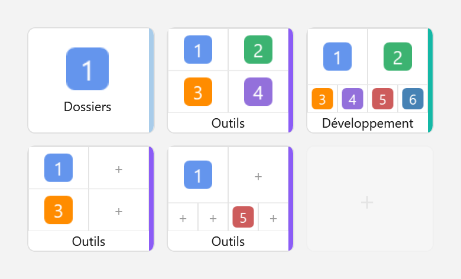 | 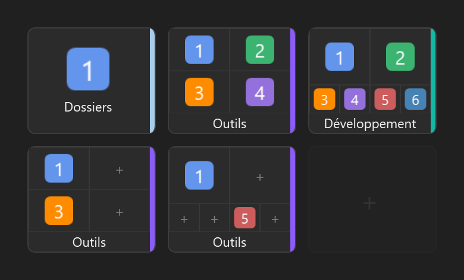 |

De gauche à droite : une tuile simple, une grille **2 × 2**, une grille **2 + 4** avec une couleur
de groupe personnalisée, puis les mêmes dispositions à sous-cases partiellement vides.

Clic droit sur une tuile ou une case vide → **Disposition** : simple, grille **2 × 2**,
ou grille **2 + 4** (deux tiers de la hauteur en haut, un tiers en bas). Chaque icône lance
son propre raccourci ; son nom et sa commande restent accessibles au survol. Une sous-case
vide permet d'ajouter un raccourci. Les groupes fonctionnent aussi dans les favoris.

Le nom du groupe est affiché en bas de la carte. **Groupe → Modifier le groupe…** permet
de modifier son nom et la couleur de sa bande droite, violette par défaut. Cette bande est
commune au groupe : les icônes internes n'ont plus de bande individuelle.
Une fois le cadenas déverrouillé, glisser ce nom déplace le groupe entier ;
glisser une icône déplace uniquement son raccourci.

- **Déplacer → Choisir une case…** : les destinations possibles sont encadrées. Cliquer sur
  une case vide déplace le raccourci ; cliquer sur un raccourci l'échange avec la source.
  La pagination reste disponible et **Échap** annule le déplacement.
- Le **glisser-déposer**, une fois le cadenas déverrouillé, fonctionne aussi entre la grille
  et les sous-cases, ainsi qu'entre deux groupes.
- **Groupe → Déplacer le groupe entier…** déplace tous ses raccourcis ensemble. Le même
  sous-menu permet de dupliquer le groupe, de changer de page ou de le transférer dans les favoris.
- Pour passer de six à quatre cases, il faut d'abord sortir les raccourcis en trop.
  Pour revenir à une tuile simple, il doit en rester au maximum un. Aucun raccourci n'est
  déplacé automatiquement hors du groupe. Les raccourcis conservés suivent l'ordre de lecture.
- La recherche inclut les raccourcis des groupes. Le raccourci clavier d'une tuile composée
  ouvre un menu permettant de choisir lequel lancer. Les groupes ne peuvent pas être imbriqués.

Les anciens fichiers de raccourcis restent lisibles. Les groupes ajoutent les champs `layout`
(`Quad` ou `TwoPlusFour`), `children` et une couleur optionnelle `groupColor` ; une valeur `null` dans `children` conserve une sous-case vide.
L'outil MCP de lecture de la grille expose également ces informations ; les actions MCP qui
visent uniquement une case entière déplacent ou suppriment le groupe entier.

## Thème clair et sombre

☰ → Paramètres → **Thème** : `Automatique (Windows)`, `Clair` ou `Sombre`.

<picture>
  <source media="(prefers-color-scheme: dark)" srcset="https://raw.githubusercontent.com/syl-craft/DockPad-media/main/videos/09-theme-language-dark.gif">
  
</picture>

- **`Automatique` suit Windows en direct** : basculer Windows en sombre change DockPad sur le champ, sans redémarrer. Un choix explicite, lui, ne bouge plus
- **La barre de titre suit aussi** — Windows ne la peint pas de lui-même
- La bascule s'applique aux **fenêtres déjà ouvertes**

Le bandeau Usage IA et les fenêtres de configuration suivent le thème, listes et champs compris.

> Les cases à cocher et les listes déroulantes ont changé d'aspect **dans les deux thèmes** : elles
> sont passées de l'habillage Windows au plat, déjà celui du reste de l'application. C'était le prix
> pour qu'elles suivent le thème — leur habillage d'origine ignore les couleurs qu'on leur donne.

## Français, anglais… et 1337

☰ → Paramètres → **Langue** : `Automatique (Windows)`, `Français`, `English` ou `1337`. Par défaut DockPad
suit la langue de Windows, et retombe sur l'anglais si elle n'est pas traduite.

- **Bascule immédiate**, sans redémarrer : les fenêtres ouvertes se retraduisent sous les yeux, la grille derrière et son bandeau compris
- **Les nombres et les heures suivent** : `12,4k` et `11h54` en français, `12.4k` et `11:54` en anglais
- **Les pluriels sont justes**, y compris là où les deux langues ne basculent pas au même endroit : « 0 règle » mais « 0 rules »
- **Les libellés du menu clic droit de Windows** sont traduits ; les entrées déjà posées se mettent à jour depuis la fenêtre **Prédéfinis**

Et une troisième langue, pour le plaisir — le **1337**, à la fin de la démonstration ci-dessus.

Elle n'est pas écrite à la main : elle est **engendrée** depuis le français par substitution de
glyphes, et se régénère d'une commande quand une chaîne est ajoutée. Elle rend un service au
passage — **tout ce qui n'y apparaît pas en leet est soit une donnée, soit une chaîne restée en dur
dans le code**. Les noms de tuiles, eux, restent lisibles : ce sont les vôtres.

## Sélecteur de navigateur

DockPad peut devenir le navigateur par défaut de Windows : au clic sur une URL, une popup propose le choix du navigateur **et de ses profils**. Les règles « Toujours pour ce domaine » ouvrent les sites connus directement, sans popup (sous-domaines inclus).

<picture>
  <source media="(prefers-color-scheme: dark)" srcset="https://raw.githubusercontent.com/syl-craft/DockPad-media/main/videos/02-browser-picker-dark.gif">
  
</picture>

Les profils des navigateurs Chromium (Chrome, Edge, Brave, Vivaldi…) sont détectés par **↻ Redétecter** et proposés sous leur navigateur ; un navigateur qui n'a qu'un seul profil reste une ligne unique. Chaque profil se masque, se renomme et peut recevoir ses propres règles de domaine.

| Navigateurs et profils | Règles de domaine |
|:---:|:---:|
| 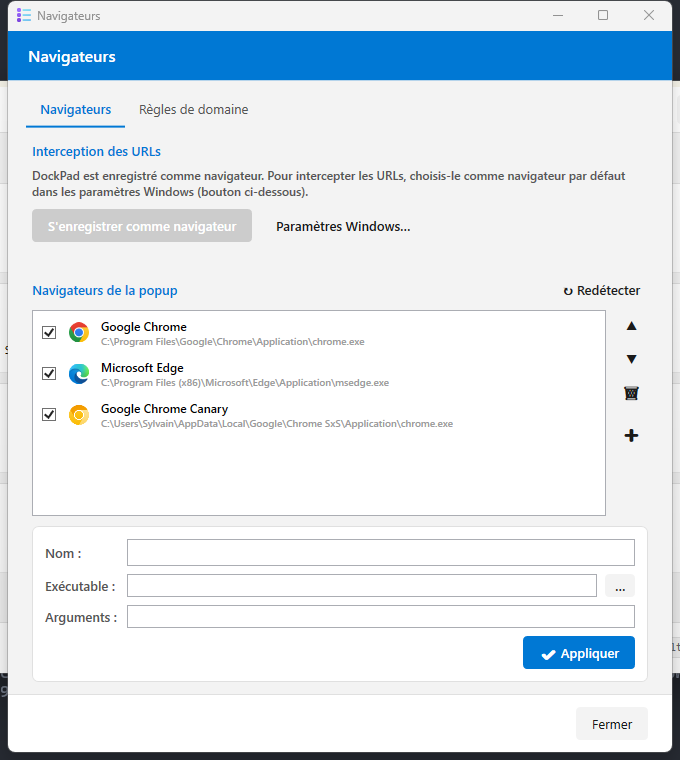 | 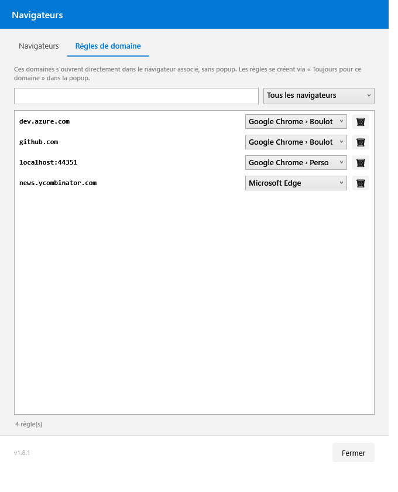 |

Clavier : `1-9` choix direct · `↑/↓` + `Entrée` · `Échap` annule · perte de focus = annule.

### Activer sur un ordinateur

- [ ] Lancer DockPad
- [ ] **☰ → Paramètres → 🌐 Navigateurs** → **↻ Redétecter** puis vérifier la liste (Chrome, Edge… et leurs profils)
- [ ] Cliquer **S'enregistrer comme navigateur**
- [ ] Cliquer **Paramètres Windows…** → définir **DockPad** comme navigateur par défaut
- [ ] Cliquer une URL n'importe où → la popup s'affiche ; cocher **Toujours pour ce domaine** pour créer une règle
- [ ] Gérer les règles dans l'onglet **Règles de domaine** (recherche, filtre, réassociation, suppression)

## Mode Favoris

Une **seconde grille**, dédiée aux sites : ses propres pages, ses propres positions, et tout ce que
la grille des raccourcis sait déjà faire — glisser-déposer, clic droit, overlay clavier, recherche.
Le bouton **▦ / ★** de la toolbar, à gauche du verrou, passe de l'une à l'autre.

<picture>
  <source media="(prefers-color-scheme: dark)" srcset="https://raw.githubusercontent.com/syl-craft/DockPad-media/main/videos/08-favorites-dark.gif">
  
</picture>

On y ajoute une page depuis la popup de choix du navigateur : l'**étoile en bas à droite** met la
page courante en favori, et la retire si on la décoche. Elle est déjà allumée à l'ouverture quand
l'URL y est — un toggle qui montre un état dit la vérité, et l'on peut mettre en favori sans ouvrir
le lien.

- Le favori garde l'**URL complète** et prend le **domaine** comme nom de tuile ; l'icône du site est
  téléchargée comme pour toute tuile web (réglage Options → *Réseau*)
- Il atterrit à la **première case libre**, pages balayées dans l'ordre ; si tout est plein, une page
  est créée
- **Une tuile passe d'une grille à l'autre** par le clic droit : « ★ Déplacer vers les favoris »,
  ou « ▦ Déplacer vers les raccourcis » depuis les favoris. Elle garde son icône et sa
  configuration, et atterrit à la première case libre
- **Le mode ne survit pas au rangement de la fenêtre** : masquer ou réduire ramène aux raccourcis.
  C'est un détour, pas un réglage — rien n'est écrit sur le disque
- Les favoris vivent dans `%APPDATA%\DockPad\favorites.json` et `favorite-pages.json`, **même
  format** que les raccourcis, et sont inclus dans 💾 *Sauvegarder la configuration*

## Bandeau Usage IA

Un bandeau sous la grille montre la consommation des assistants IA détectés : les deux jauges de quota (session de 5 h et semaine) avec leur heure de remise à zéro, puis les jetons de la session, du jour et du mois, le nombre de requêtes, le coût estimé et le modèle en cours. Un onglet par fournisseur quand il y en a plusieurs.

<picture>
  <source media="(prefers-color-scheme: dark)" srcset="https://raw.githubusercontent.com/syl-craft/DockPad-media/main/videos/03-usage-dark.gif">
  
</picture>

Quatre assistants sont lus, chacun dans ses fichiers locaux, sans réseau :

| Assistant | Source | Quota | Coût |
|---|---|---|---|
| **Claude Code** | `%USERPROFILE%\.claude\projects` | oui | estimé |
| **Codex** | `%USERPROFILE%\.codex\sessions` et `archived_sessions` | oui, dernier relevé local | non |
| **Gemini CLI** | `%USERPROFILE%\.gemini\tmp\<hash>\chats` | non | non |
| **Copilot CLI** | `%USERPROFILE%\.copilot\session-store.db` | non | non |

Les quotas Claude viennent de l'API Anthropic, avec le jeton du compte déjà présent sur la machine.
Les quotas **Codex** sont lus dans les événements `token_count` des sessions locales : aucun
processus supplémentaire ni accès aux identifiants n'est nécessaire. Le relevé le plus récent
est retenu parmi les sessions et les archives, selon sa date d'observation.

Chaque jauge Codex suit la durée annoncée : 5 h pour la session, 7 jours pour la semaine. Un compte
qui n'expose qu'une limite hebdomadaire affiche uniquement cette jauge, même si Codex la place
dans le champ `primary`. Une fenêtre expirée ou un relevé de plus de **15 minutes** est masqué ;
si aucune jauge n'est disponible, une notice explique l'absence. Utiliser Codex actualise les
relevés, que DockPad relit au prochain rafraîchissement. Gemini et Copilot restent sans jauges.

Une seule jauge occupe toute la largeur disponible ; deux jauges se partagent cet espace.
La pastille à droite ouvre la page web des usages de Claude ou de Codex.

Si le quota Claude n'est pas joignable — l'API limite le débit, le jeton a expiré, la réponse change de forme — **les jauges cèdent la place à une explication** qui annonce la prochaine tentative, avec la cause technique au survol. Les jetons, eux, sont lus en local : ils restent exacts et affichés.

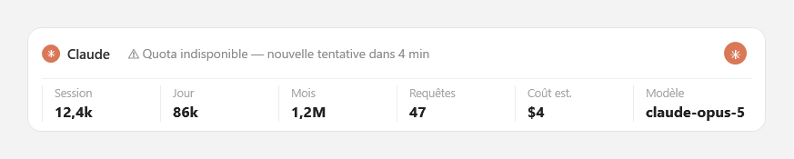

Un assistant **installé mais que tu n'as pas utilisé sur la période** garde son onglet, à zéro : disparaître du bandeau veut dire « pas installé », et rien d'autre. Les valeurs qui n'auraient pas de sens s'affichent `—` plutôt que `0`.

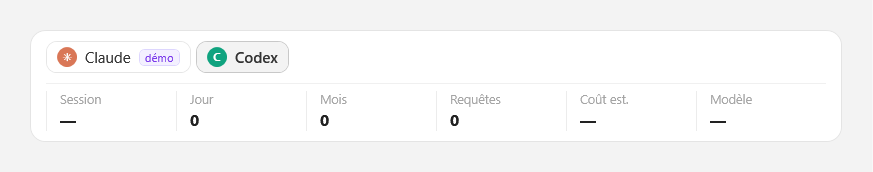

Le **coût** n'est calculé que pour Claude, à partir des tarifs publics, et affiché dans la devise de la source — DockPad ne convertit jamais. Un abonnement Max ou Pro ne facture pas au jeton : le montant indique un ordre de grandeur, pas une facture. Pour les trois autres, la colonne affiche un tiret plutôt qu'un montant inventé.

Un fournisseur **Démo** est fourni, masqué par défaut : il sert aux captures de documentation et permet d'essayer le changement d'onglet. Les chiffres de démonstration portent toujours un badge « démo ».

Réglages via **☰ Menu → Paramètres → 📊 Usage IA** : afficher ou masquer le bandeau, seuil d'alerte des jauges, affichage du coût, fournisseur affiché à l'ouverture, et détection des assistants installés (**↻ Redétecter**, jamais en tâche de fond).

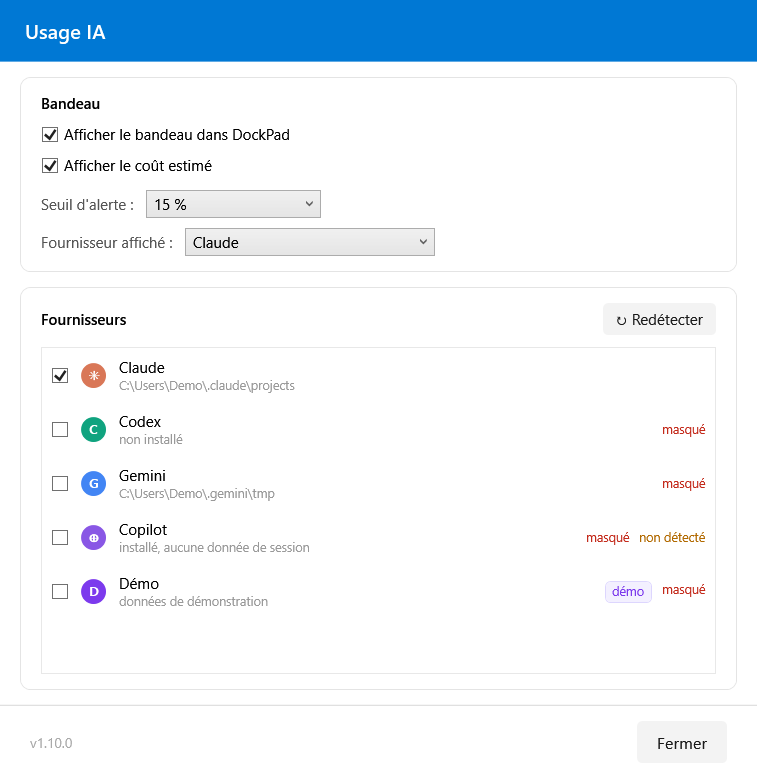

## Serveur MCP — piloter DockPad avec Claude

DockPad expose un serveur [MCP](https://modelcontextprotocol.io) : depuis Claude Code ou Claude Desktop, Claude peut lire l'état de la grille, ajouter des raccourcis (unitairement ou en lot), créer et réorganiser des pages, et gérer les navigateurs et règles de domaine — la grille se met à jour en direct, sans toucher à l'application.

> « Ajoute une page avec VS Code, un terminal sur C:\dev et le dossier du projet » → trois tuiles apparaissent, placées sur les cases libres.

<picture>
  <source media="(prefers-color-scheme: dark)" srcset="https://raw.githubusercontent.com/syl-craft/DockPad-media/main/videos/07-mcp-dark.gif">
  
</picture>

| Configuration (Options) | Journal des actions |
|:---:|:---:|
| 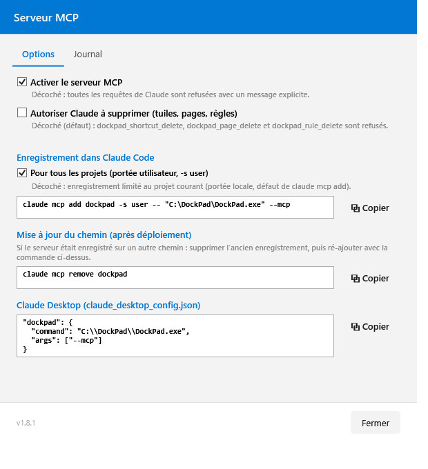 | 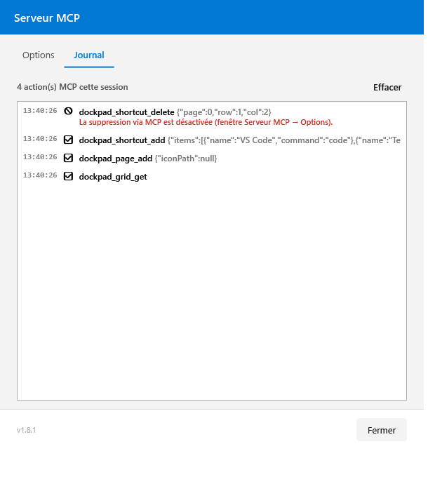 |

**15 outils** `dockpad_<domaine>_<action>` (positions 0-based : page 0, lignes 0-3, colonnes 0-5) :

| Domaine | Outils |
|---|---|
| Grille | `grid_get` · `shortcut_add` (lot tout-ou-rien) · `shortcut_update` · `shortcut_move` · `shortcut_delete` 🔒 · `group_set` |
| Pages | `page_add` · `page_update` (icône, position) · `page_delete` 🔒 |
| Navigateurs | `browser_list` · `browser_update` · `rule_list` · `rule_add` · `rule_delete` 🔒 |
| Usage IA | `usage_get` (quotas, lecture seule) |

`dockpad_shortcut_move` accepte en plus un **`toTarget`** : omis, le déplacement reste dans la grille comme avant ; différent de `target`, la tuile change de grille et se pose à la première case libre, en gardant son icône.

**Tuiles groupées** : `dockpad_group_set` crée un groupe (`Quad` ou `TwoPlusFour`) sur une case vide ou autour d’une tuile existante, change sa disposition, son nom ou sa couleur. Les sous-cases se remplissent avec `shortcut_add` et un **`slot`** ; `shortcut_update`, `shortcut_delete` et `shortcut_move` acceptent aussi `slot`, et `shortcut_move` un `toSlot` pour ranger une tuile dans une sous-case **libre** — le serveur refuse une sous-case occupée au lieu d’échanger, comme partout ailleurs. `grid_get` expose `groupColor` et `freeSlots`.

Les neuf outils de grille et de pages acceptent un **`target`** optionnel — `"shortcuts"` (défaut) ou `"favorites"` — pour travailler sur l’une ou l’autre grille. Une valeur inconnue est refusée plutôt que ramenée aux raccourcis : écrire dans la mauvaise grille sans le dire serait pire.

**Quotas Usage IA** : `dockpad_usage_get` renvoie, pour chaque assistant qui en expose un
(aujourd'hui Claude et Codex), le quota de session et de semaine — pourcentage consommé et restant,
heure de remise à zéro avec son décalage horaire et minutes restantes. N'importe quel client MCP
peut l'appeler — Claude Code, Claude Desktop, Codex — et lit sa propre entrée par son id. Un relevé
ancien est marqué `stale` avec son `observedAt` ; un quota momentanément illisible revient avec
`quotaAvailable: false` et la notice qu'affiche le bandeau. Sans argument, l'outil suit le bandeau
(les fournisseurs masqués sont ignorés) ; `provider` lit un seul assistant, même masqué. DockPad
relit à chaque appel, par les mêmes fournisseurs que le bandeau : l'API de quota d'Anthropic reste
appelée au plus une fois toutes les cinq minutes.

**Sécurité par défaut** : les outils 🔒 de suppression sont refusés tant que la case « Autoriser Claude à supprimer » n'est pas cochée — Claude peut construire, pas détruire. Chaque action (exécutée ✅, refusée 🚫 ou en erreur ❌) est visible dans l'onglet **Journal** et tracée dans les logs. Configuration dans `%APPDATA%\DockPad\mcp.json`, incluse dans 💾 Sauvegarder la configuration.

### Activer sur un ordinateur

- [ ] Lancer DockPad (l'application doit tourner : le serveur MCP dialogue avec l'instance en cours)
- [ ] **☰ → Paramètres → 🔌 Serveur MCP** → onglet Options
- [ ] Copier la commande d'enregistrement (⧉) et l'exécuter dans un terminal :
  `claude mcp add dockpad -s user -- "C:\DockPad\DockPad.exe" --mcp`
  (décocher « Pour tous les projets » pour un enregistrement limité au projet courant ; snippet `claude_desktop_config.json` fourni pour Claude Desktop)
- [ ] Ouvrir une session Claude Code → `/mcp` liste le serveur `dockpad` et ses 15 outils
- [ ] Demander par exemple : *« montre-moi ma grille DockPad »* ou *« ajoute un raccourci Bloc-notes »*
- [ ] En cas de changement de chemin de l'exe : `claude mcp remove dockpad` puis ré-ajouter (bloc « Mise à jour du chemin » de la fenêtre)

## Menu contextuel Windows

**☰ Menu → Raccourcis prédéfinis** ajoute vos outils au menu clic droit d'un dossier dans
l'Explorateur : un terminal Claude ou Codex ouvert dans ce dossier, PowerShell, Visual Studio Code,
SQL Server Management Studio, GitHub Desktop. Chaque entrée indique si elle est déjà installée ou
si une mise à jour l'attend ; **☰ Menu → Gestion** liste, modifie et supprime toutes les entrées du
menu contextuel Windows (HKCU / HKLM / HKCR). Modifier les entrées de la machine demande les droits
administrateur : le bouton **🛡 Élever** relance DockPad en administrateur au besoin.

<picture>
  <source media="(prefers-color-scheme: dark)" srcset="https://raw.githubusercontent.com/syl-craft/DockPad-media/main/videos/11-context-menu-dark.gif">
  
</picture>

## Injection de secrets depuis Vaultwarden

Clic droit sur **n'importe quel fichier** → **Injecter les secrets…**. DockPad remplace les marqueurs `{{ bw:item:champ }}` par les valeurs du coffre, et **le fichier dit lui-même ce qu'on fait de lui** — il n'y a rien à choisir au moment du clic.

| Ce que porte le fichier | Ce que DockPad produit |
|---|---|
| des marqueurs `{{ bw:item:champ }}` | le rendu dans le **presse-papier**, prêt à coller |
| des annotations `x-bw:` sous `secrets:` | les **fichiers de secrets** dans un sous-dossier `secrets/` |
| les deux | **les deux**, avec un écran pour choisir |
| un marqueur précédé d'un antislash — `\{{ … }}` | le marqueur **littéral** : un README peut documenter la syntaxe |

<picture>
  <source media="(prefers-color-scheme: dark)" srcset="https://raw.githubusercontent.com/syl-craft/DockPad-media/main/videos/04-secrets-dark.gif">
  
</picture>

Quand le fichier porte les deux formats, un écran permet de choisir ce qu'on produit — avant d'ouvrir le coffre :

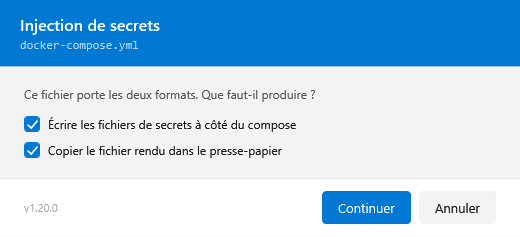

**Aucune clé de session n'est conservée** : le mot de passe maître est redemandé à chaque injection, il ne quitte jamais l'environnement du processus enfant, et il n'apparaît dans aucune ligne de commande. Le rendu est retiré du presse-papier après un délai réglable (90 s par défaut), **à condition qu'il s'y trouve toujours** — si tu as copié autre chose entre-temps, rien n'est effacé.

### Syntaxe des marqueurs

```
{{ bw:<item>:<champ> }}
```

Les espaces autour des `:` et des accolades sont facultatifs — `{{bw:item:champ}}` marche aussi. Le
**nom d'item accepte les espaces** (`{{ bw:Infra maison:token }}`), le nom de champ non : le `:` et le
`}}` suffisent à délimiter.

Un marqueur se remplace **dans n'importe quel fichier**, pas seulement du YAML — un `.env`, un
`Dockerfile`, un script. C'est le contenu qui décide, jamais l'extension — sauf `.vault`, qui est
toujours un [inventaire GitHub](#secrets-et-variables-github-depuis-vaultwarden).

**L'item est cherché par son nom exact**, sans tenir compte de la casse :

| Ce que le coffre répond | Ce que DockPad fait |
|---|---|
| un seul item de ce nom | il est utilisé |
| aucun | refus **qui nomme l'item**, et rappelle l'organisation si une est configurée |
| deux ou plus | refus : DockPad ne devine pas. Renommer l'un des deux, ou cantonner à une organisation |

**Le champ suit un ordre, et le personnalisé gagne toujours :**

| `<champ>` | Ce qui est lu |
|---|---|
| n'importe quel nom | le **champ personnalisé** de ce nom, s'il existe |
| `password` | le mot de passe de l'identifiant |
| `username` | l'identifiant |
| `notes` | les notes de l'item |
| `totp` | la graine TOTP |

Un champ personnalisé nommé `password` masque donc le mot de passe standard — et **ne retombe pas
dessus s'il est vide** : le champ qu'on a nommé soi-même existe, et le dire franchement vaut mieux
que d'aller chercher ailleurs une valeur que personne n'a demandée.

Une **valeur vide compte comme absente** : le champ existe mais ne porte rien, ce qui produirait une
ligne syntaxiquement valide et fonctionnellement fausse.

**Une pièce jointe, une propriété JSON.** `@<nom>` à la place du champ désigne une **pièce jointe** de
l'item, par son nom de fichier (sans distinction de casse), et `|json:<chemin>` en extrait une seule
propriété — d'une pièce jointe, d'un champ ou des notes :

```
{{ bw:web-store:@service-account.json }}                     la pièce jointe entière
{{ bw:web-store:@service-account.json|json:private_key }}     une propriété
{{ bw:infra:config|json:servers.0.host }}                     chemin pointé, index de tableau en base 0
```

Une chaîne JSON est rendue décodée (les `\n` deviennent de vrais retours à la ligne), un nombre ou un
booléen tel qu'il est écrit. `null`, un objet, un tableau, un chemin absent, un JSON invalide, une
pièce jointe absente, en double, binaire ou de plus de 4 Mo : le marqueur échoue en le nommant. Seules
les pièces jointes citées sont téléchargées, et jamais écrites sur le disque. Un tel marqueur n'est
jamais proposé à la création.

**Deux formes échappent au remplacement :**

| Écrit | Effet |
|---|---|
| `\{{ bw:item:champ }}` | le marqueur **littéral**, antislash retiré, jamais cherché dans le coffre |
| `REMPLACER` | rien — mais il est **signalé** dans le compte-rendu : c'est le marqueur manuel qui a causé la panne d'origine |

### Syntaxe des annotations `x-bw`

Compose ignore tout champ commençant par `x-`, donc l'annotation cohabite sans rien changer au déploiement :

```yaml
secrets:
  ntfy-ts-authkey:
    file: /share/.../secrets/ts-authkey
    x-bw:
      item: ntfy-infra          # la valeur du coffre EST le contenu
      field: ntfy-ts-authkey

  ntfy-config:
    file: /share/.../secrets/server.yml
    x-bw:
      template: templates/ntfy-config/server.yml   # un modèle local est rendu
```

Chaque entrée annotée doit porter un `file:` : **son nom de base** devient le nom du fichier produit
(`ts-authkey`, et non la clé du secret). Le chemin complet vise le NAS et n'est pas exploitable ici.

Les noms `.gitignore` et ceux se terminant par `.dockpad-tmp` sont réservés, sans distinction de
casse. Les noms terminés par un point ou une espace sont également refusés. Un nom réservé ou deux
destinations de même nom font refuser le lot avant toute écriture.

`item` + `field` et `template` sont **exclusifs** — les deux ensemble sont un refus, il n'y a qu'un
fichier à produire ; aucun des deux également.

`attachment:` remplace `field:` pour lire une pièce jointe, et `select:` extrait une propriété JSON de
l'un ou de l'autre — l'annotation se résout comme le marqueur `{{ bw:item:@pièce-jointe|json:chemin }}`.
`field` et `attachment` ensemble sont un refus, `select` à côté d'un `template` aussi.

`template:` sert aux fichiers de **structure** dont seules quelques valeurs sont sensibles. Le modèle
reste versionné à sa place, `secrets/` ne contient que du produit — et s'ignore lui-même par un
`.gitignore` posé automatiquement. Trois règles s'y appliquent :

- le chemin est **relatif au dossier du compose** et doit y rester. C'est la seule annotation qui
  désigne *quoi lire*, et elle vient d'un fichier : un chemin qui remonte est refusé ;
- le rendu est **tout ou rien, par fichier** — un seul marqueur non résolu et ce fichier n'est pas
  écrit. Contrairement au presse-papier, où le marqueur reste visible dans ce qu'on colle, un fichier
  part sur le NAS sans être relu ;
- les fins de ligne sont **normalisées en LF** : le modèle vient d'un dépôt git qui a pu l'extraire
  en CRLF, la destination est un conteneur Linux. Une *valeur* du coffre, elle, n'est jamais
  touchée — c'est un secret, on l'écrit telle qu'elle est.

Les fichiers produits n'ont **pas de saut de ligne final** : Vaultwarden rogne ce qu'il lit via
`_FILE`, mais `containerboot` lit `TS_AUTHKEY` par `file:` sans rien rogner.

### Quand une clé manque

Une clé absente du coffre n'annule plus le reste : les secrets présents sont écrits, le rendu est produit, et un écran **ambre** liste ce qui manque. Les marqueurs non résolus restent visibles dans le texte, et un fichier de secret n'est **jamais** écrit vide ou à moitié rendu — il est simplement absent, et nommé.

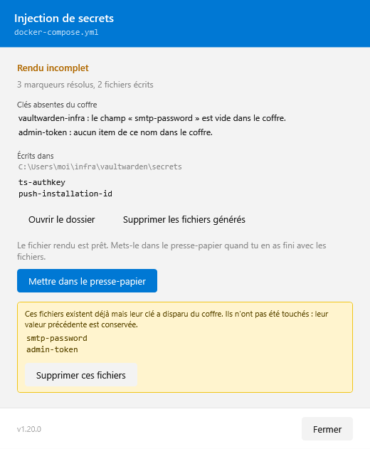

Les fichiers dont la clé a disparu du coffre sont **signalés, jamais supprimés d'office** : un coffre temporairement inaccessible ne doit pas détruire un déploiement qui marche.

### Activer sur un ordinateur

- [ ] Installer la **CLI Bitwarden** — `winget install Bitwarden.CLI` (le client de bureau ne la fournit pas : ce sont deux produits distincts)
- [ ] `bw config server https://<ton-vaultwarden>` puis `bw login`
- [ ] **☰ → Paramètres → onglet Secrets** : renseigner l'organisation si le coffre en a une, et cocher **Ajouter au menu contextuel**
- [ ] Sur Windows 11, l'entrée est sous **Afficher plus d'options** (Maj + clic droit)
- [ ] Clic droit sur un fichier portant des marqueurs → **Injecter les secrets…**
- [ ] Laisser cochée **Synchroniser le coffre avant d'injecter** : la CLI lit un cache local, et sans elle un item que tu viens de modifier n'est pas encore visible

## Secrets et variables GitHub depuis Vaultwarden

Un fichier **`.vault`** liste les secrets — ou les variables — d'un environnement GitHub Actions,
avec pour chacun une **référence au coffre** et jamais une valeur. Clic droit → **Injecter les
secrets…** : DockPad le compare à GitHub, déverrouille le coffre, puis envoie les valeurs par la CLI
GitHub.

<picture>
  <source media="(prefers-color-scheme: dark)" srcset="https://raw.githubusercontent.com/syl-craft/DockPad-media/main/videos/13-github-sync-dark.gif">
  
</picture>

```ini
# github-variables repo=${owner}/${project} environment=stores
@owner = example
@project = my-extension
@item = web-store-apps
CHROME_EXTENSION_ID={{ bw:${item}:my-extension-CHROME_EXTENSION_ID }}
EDGE_PRODUCT_ID={{ bw:${item}:my-extension-EDGE_PRODUCT_ID }}
```

- **C'est l'extension `.vault` qui décide** : un tel fichier est toujours un inventaire, jamais rendu
  dans le presse-papier. Son en-tête — `# github-secrets` ou `# github-variables` — nomme la cible :
  le dépôt, et l'environnement s'il y en a un (sans `environment=`, les secrets du dépôt lui-même)
- **Les variables** `@nom = valeur`, citées par `${nom}` dans l'en-tête et les marqueurs, évitent
  de répéter le dépôt ou l'item. Ce sont des littéraux, jamais envoyés à GitHub
- **Une ligne, c'est un marqueur et rien d'autre** : du texte autour partirait en clair sur GitHub,
  il est donc refusé
- **Vérifié avant de déverrouiller le coffre** : DockPad montre ce qui sera créé, ce qui sera écrasé
  — avec son âge, pour voir venir une clé qui expire — et ce qui n'existe que sur GitHub. Ce dernier
  groupe est **signalé, jamais supprimé**
- **Tout ou rien** : un seul marqueur non résolu et rien ne part. Chaque valeur passe par l'**entrée
  standard** de `gh secret set` / `gh variable set`, jamais par une ligne de commande

### Activer sur un ordinateur

- [ ] Tout ce que demande l'injection de secrets ci-dessus (CLI Bitwarden, connexion, entrée de menu)
- [ ] Installer la **CLI GitHub** — `winget install GitHub.cli` — puis `gh auth login` avec le compte propriétaire du dépôt
- [ ] **☰ → Paramètres → onglet Secrets → CLI GitHub** : laisser vide pour la détection automatique, ou **Détecter**
- [ ] Clic droit sur un fichier `.vault` → **Injecter les secrets…**

## Prérequis

- Windows 10/11 x64
- [.NET 8 Runtime](https://dotnet.microsoft.com/download/dotnet/8.0) (Desktop)
- *Pour l'injection de secrets uniquement* : la [CLI Bitwarden](https://bitwarden.com/help/cli/), sous GPL-3.0, à installer séparément — `winget install Bitwarden.CLI`
- *Pour les secrets et variables GitHub uniquement* : la [CLI GitHub](https://cli.github.com/), sous MIT, à installer séparément — `winget install GitHub.cli`

## Installation

1. Télécharger `DockPad-X.Y.Z-win-x64-Setup.exe` dans les fichiers joints à la [dernière release GitHub](https://github.com/syl-craft/DockPad/releases/latest), puis l'exécuter pour une installation par utilisateur.
2. Pour le mode portable, extraire `DockPad-win-Portable.zip` dans un dossier vide et lancer `DockPad.exe` à sa racine.
3. Depuis un ancien ZIP, fermer DockPad avant cette première migration. Les réglages restent dans `%APPDATA%\DockPad`. Les clients MCP qui pointent vers un ancien dossier doivent utiliser le nouveau lanceur stable.

Windows x64 avec .NET Desktop Runtime 8. Le Setup peut installer le runtime manquant.
La première release Velopack est **non signée** : Windows peut afficher un avertissement concernant
l'éditeur. SignPath et la publication WinGet sont en préparation. Les paquets `.nupkg` et
`releases.win.json` sont destinés au système de mise à jour ; pour installer, utiliser le Setup ou le portable.

## Build

```bash
dotnet build
```

### Publish (release)

```bash
dotnet publish -p:PublishProfile=FolderProfile
```

Génère `release\DockPad-{version}.zip` et `release\DockPad-{version}-Changelog.md`.

## Configuration

Les fichiers de configuration sont dans `%APPDATA%\DockPad\` :

| Fichier | Contenu |
|---------|---------|
| `shortcuts.json` | Tuiles de la grille de raccourcis |
| `pages.json` | Configuration des boutons de pagination |
| `favorites.json`, `favorite-pages.json` | Tuiles et pages de la grille des favoris |
| `settings.json` | Paramètres de l'application : raccourci clavier, langue, thème, etc. |
| `mcp.json` | Activation du serveur MCP et autorisation de suppression |
| `browsers.json` | Navigateurs du sélecteur + règles de domaine |
| `usage.json` | Bandeau Usage IA : réglages + fournisseurs détectés |
| `icons\` | Cache d'icônes (PNG, déduplication SHA1) |
| `.backup\` | Sauvegardes horodatées |

Les sauvegardes JSON remplacent le fichier après écriture complète d'un temporaire dans le même
dossier. Si une configuration est illisible, DockPad utilise des valeurs de repli pour l'affichage
et refuse de les enregistrer par-dessus le fichier existant. Après réparation ou restauration du
fichier, rafraîchir la vue concernée ou redémarrer DockPad permet de le relire et de reprendre les
modifications. Le journal indique le fichier en cause.

Les anciens paramètres de `HKCU\Software\DockPad\Settings` sont repris dans `settings.json`
à sa création. Le démarrage automatique reste une inscription dans le registre Windows.

## Raccourci clavier par défaut

`Ctrl + Shift + M` — affiche/remet au premier plan la fenêtre principale.
Configurable via **☰ Menu → Options**.

## Licence

DockPad est distribué sous [licence MIT](LICENSE), copyright 2026 syl-craft.
Les dépendances et les éléments tiers conservent leurs licences et marques respectives,
notamment [les logos des fournisseurs](Assets/ProviderLogos.LICENSE.txt) et Velopack
(notice incluse dans les paquets).

## Code signing policy

La signature de confiance est **en préparation**, sans admission SignPath obtenue à ce jour.
Voir la [politique de signature et la procédure d'activation](docs/code-signing.md).
