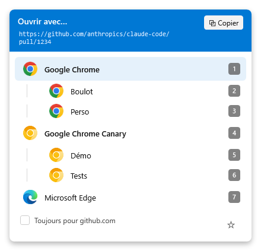
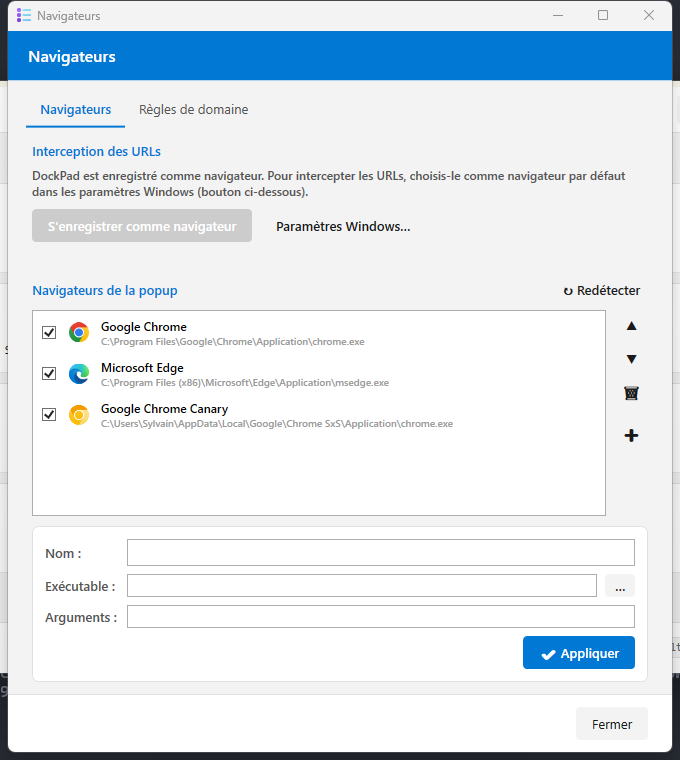
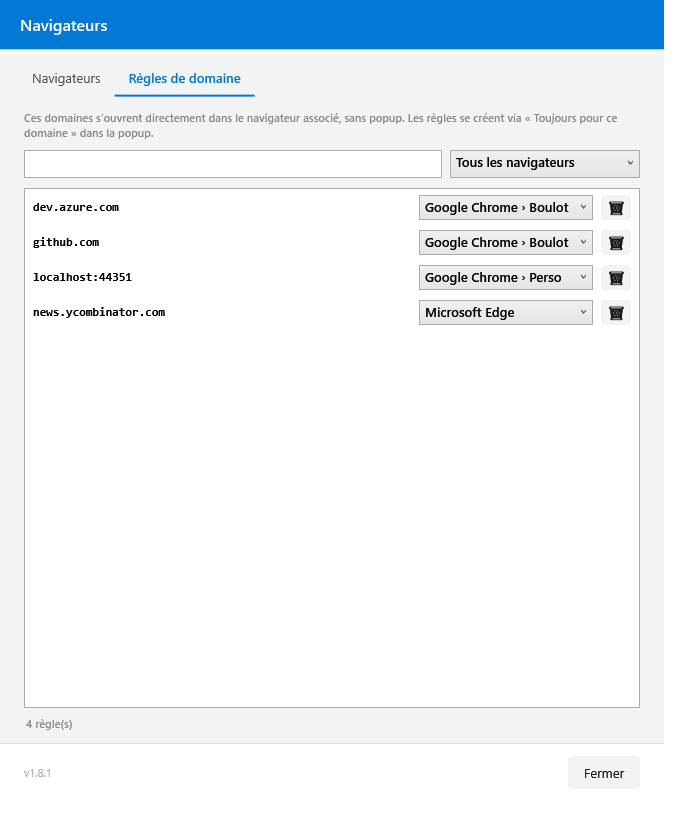
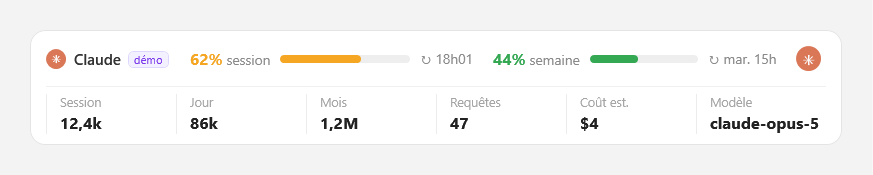
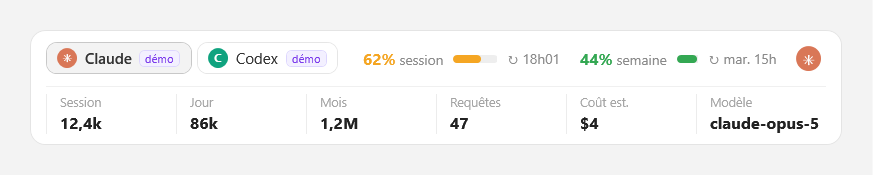
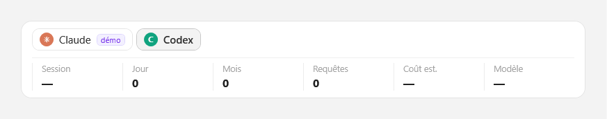
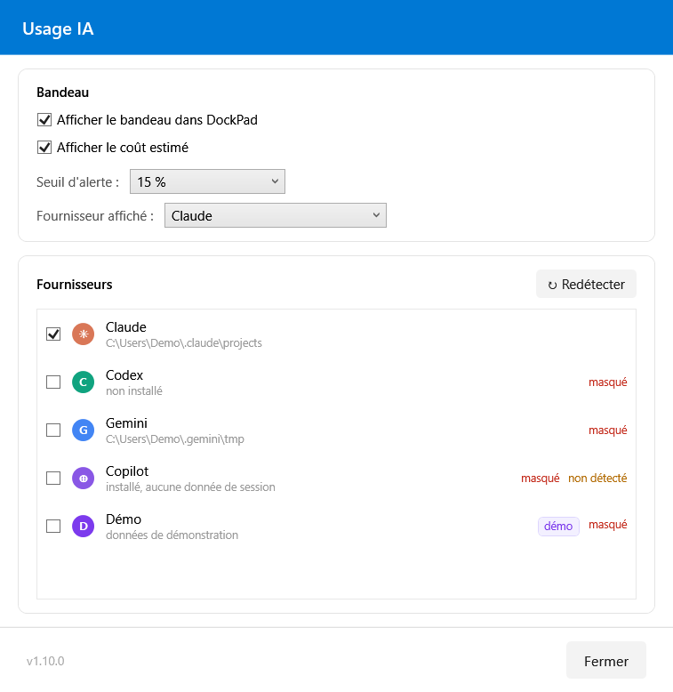
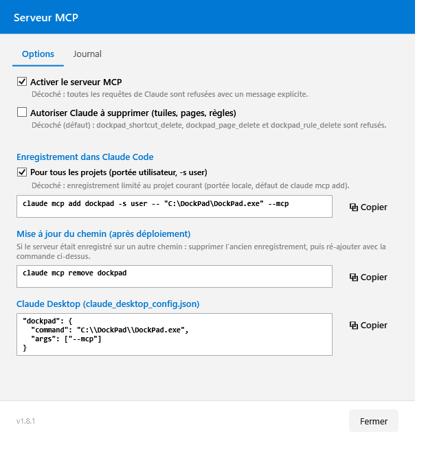
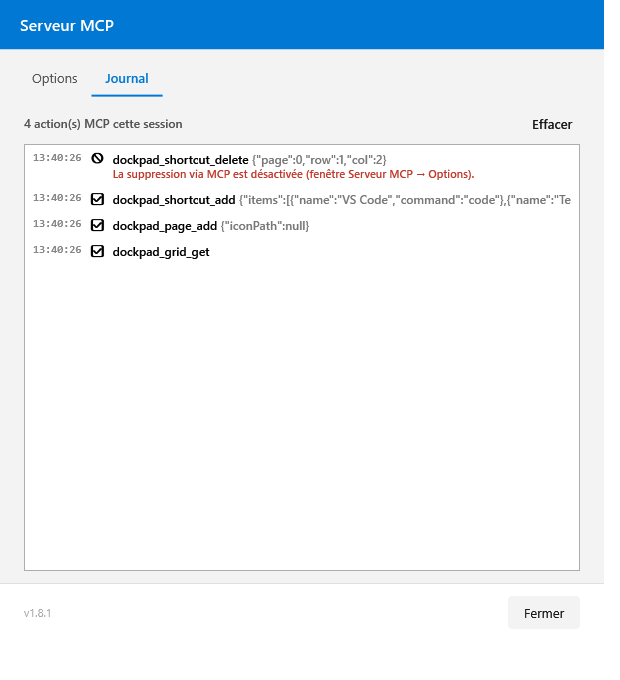

# DockPad

Application WPF (.NET 8, x64) de **barre de lancement rapide** avec gestion du menu contextuel Windows.

## Fonctionnalités

- **Grille de tuiles** multi-pages (4 × 6) avec raccourci clavier global configurable
- **Types de raccourcis** : lancer une commande, ouvrir un dossier, URL, terminal, basculer vers un processus
- **Drag & drop** depuis l'Explorateur Windows (dossier → OpenFolder, fichier .url → OpenUrl)
- **Barre de recherche** globale avec navigation clavier
- **Overlay numérique** (Ctrl/Shift + 1–9) pour exécution rapide au clavier
- **Store d'icônes** portable dans `%APPDATA%\DockPad\icons\`
- **Gestionnaire de menu contextuel** Windows (HKCU / HKLM / HKCR)
- **Raccourcis prédéfinis** : Claude Code, PowerShell, VS Code, SSMS, GitHub Desktop
- **Sélecteur de navigateur** : popup de choix au clic sur une URL + règles par domaine
- **Serveur MCP** : Claude (Claude Code / Claude Desktop) peut gérer la grille, les pages et les navigateurs
- **Bandeau Usage IA** : consommation de jetons de Claude Code, Codex, Gemini et Copilot, sous la grille
- **Icône systray** — l'application tourne en arrière-plan, instance unique (Mutex)
- **Démarrage automatique** avec Windows configurable

## Sélecteur de navigateur

DockPad peut devenir le navigateur par défaut de Windows : au clic sur une URL, une popup propose le choix du navigateur **et de ses profils**. Les règles « Toujours pour ce domaine » ouvrent les sites connus directement, sans popup (sous-domaines inclus).

Les profils des navigateurs Chromium (Chrome, Edge, Brave, Vivaldi…) sont détectés par **↻ Redétecter** et proposés sous leur navigateur ; un navigateur qui n'a qu'un seul profil reste une ligne unique. Chaque profil se masque, se renomme et peut recevoir ses propres règles de domaine.

| Popup au clic sur une URL | Navigateurs et profils | Règles de domaine |
|:---:|:---:|:---:|
|  |  |  |

Clavier : `1-9` choix direct · `↑/↓` + `Entrée` · `Échap` annule · perte de focus = annule.

### Activer sur un ordinateur

- [ ] Lancer DockPad
- [ ] **☰ → Paramètres → 🌐 Navigateurs** → **↻ Redétecter** puis vérifier la liste (Chrome, Edge… et leurs profils)
- [ ] Cliquer **S'enregistrer comme navigateur**
- [ ] Cliquer **Paramètres Windows…** → définir **DockPad** comme navigateur par défaut
- [ ] Cliquer une URL n'importe où → la popup s'affiche ; cocher **Toujours pour ce domaine** pour créer une règle
- [ ] Gérer les règles dans l'onglet **Règles de domaine** (recherche, filtre, réassociation, suppression)

## Bandeau Usage IA

Un bandeau sous la grille montre la consommation des assistants IA détectés : les deux jauges de quota (session de 5 h et semaine) avec leur heure de remise à zéro, puis les jetons de la session, du jour et du mois, le nombre de requêtes, le coût estimé et le modèle en cours. Un onglet par fournisseur quand il y en a plusieurs.



Avec plusieurs fournisseurs, un onglet apparaît pour chacun :



Quatre assistants sont lus, chacun dans ses fichiers locaux, sans réseau :

| Assistant | Source | Quota | Coût |
|---|---|---|---|
| **Claude Code** | `%USERPROFILE%\.claude\projects` | oui | estimé |
| **Codex** | `%USERPROFILE%\.codex\sessions` et `archived_sessions` | non | non |
| **Gemini CLI** | `%USERPROFILE%\.gemini\tmp\<hash>\chats` | non | non |
| **Copilot CLI** | `%USERPROFILE%\.copilot\session-store.db` | non | non |

Seul Claude expose des pourcentages de quota : ils viennent de l'API Anthropic, avec le jeton du compte déjà présent sur la machine. Pour les trois autres, il n'existe pas de limite lisible localement — leurs deux jauges restent donc masquées, et seules les métriques de jetons s'affichent. Si le quota Claude n'est pas joignable, ses jauges se masquent aussi et les jetons restent affichés.

Un assistant **installé mais que tu n'as pas utilisé sur la période** garde son onglet, à zéro : disparaître du bandeau veut dire « pas installé », et rien d'autre. Les valeurs qui n'auraient pas de sens s'affichent `—` plutôt que `0`.



Le **coût** n'est calculé que pour Claude, à partir des tarifs publics, et affiché dans la devise de la source — DockPad ne convertit jamais. Un abonnement Max ou Pro ne facture pas au jeton : le montant indique un ordre de grandeur, pas une facture. Pour les trois autres, la colonne affiche un tiret plutôt qu'un montant inventé.

Un fournisseur **Démo** est fourni, masqué par défaut : il sert aux captures de documentation et permet d'essayer le changement d'onglet. Les chiffres de démonstration portent toujours un badge « démo ».

Réglages via **☰ Menu → Paramètres → 📊 Usage IA** : afficher ou masquer le bandeau, seuil d'alerte des jauges, affichage du coût, fournisseur affiché à l'ouverture, et détection des assistants installés (**↻ Redétecter**, jamais en tâche de fond).



## Serveur MCP — piloter DockPad avec Claude

DockPad expose un serveur [MCP](https://modelcontextprotocol.io) : depuis Claude Code ou Claude Desktop, Claude peut lire l'état de la grille, ajouter des raccourcis (unitairement ou en lot), créer et réorganiser des pages, et gérer les navigateurs et règles de domaine — la grille se met à jour en direct, sans toucher à l'application.

> « Ajoute une page avec VS Code, un terminal sur C:\dev et le dossier du projet » → trois tuiles apparaissent, placées sur les cases libres.

| Configuration (Options) | Journal des actions |
|:---:|:---:|
|  |  |

**13 outils** `dockpad_<domaine>_<action>` (positions 0-based : page 0, lignes 0-3, colonnes 0-5) :

| Domaine | Outils |
|---|---|
| Grille | `grid_get` · `shortcut_add` (lot tout-ou-rien) · `shortcut_update` · `shortcut_move` · `shortcut_delete` 🔒 |
| Pages | `page_add` · `page_update` (icône, position) · `page_delete` 🔒 |
| Navigateurs | `browser_list` · `browser_update` · `rule_list` · `rule_add` · `rule_delete` 🔒 |

**Sécurité par défaut** : les outils 🔒 de suppression sont refusés tant que la case « Autoriser Claude à supprimer » n'est pas cochée — Claude peut construire, pas détruire. Chaque action (exécutée ✅, refusée 🚫 ou en erreur ❌) est visible dans l'onglet **Journal** et tracée dans les logs. Configuration dans `%APPDATA%\DockPad\mcp.json`, incluse dans 💾 Sauvegarder la configuration.

### Activer sur un ordinateur

- [ ] Lancer DockPad (l'application doit tourner : le serveur MCP dialogue avec l'instance en cours)
- [ ] **☰ → Paramètres → 🔌 Serveur MCP** → onglet Options
- [ ] Copier la commande d'enregistrement (⧉) et l'exécuter dans un terminal :
  `claude mcp add dockpad -s user -- "C:\DockPad\DockPad.exe" --mcp`
  (décocher « Pour tous les projets » pour un enregistrement limité au projet courant ; snippet `claude_desktop_config.json` fourni pour Claude Desktop)
- [ ] Ouvrir une session Claude Code → `/mcp` liste le serveur `dockpad` et ses 13 outils
- [ ] Demander par exemple : *« montre-moi ma grille DockPad »* ou *« ajoute un raccourci Bloc-notes »*
- [ ] En cas de changement de chemin de l'exe : `claude mcp remove dockpad` puis ré-ajouter (bloc « Mise à jour du chemin » de la fenêtre)

## Prérequis

- Windows 10/11 x64
- [.NET 8 Runtime](https://dotnet.microsoft.com/download/dotnet/8.0) (Desktop)

## Installation

1. Télécharger `DockPad-{version}.zip` depuis `release\`
2. Extraire dans `C:\DockPad\`
3. Lancer `DockPad.exe`

## Build

```bash
dotnet build
```

### Publish (release)

```bash
dotnet publish -p:PublishProfile=FolderProfile
```

Génère `release\DockPad-{version}.zip` et `release\DockPad-{version}-Changelog.md`.

## Configuration

Les fichiers de configuration sont dans `%APPDATA%\DockPad\` :

| Fichier | Contenu |
|---------|---------|
| `shortcuts.json` | Tuiles de la grille de raccourcis |
| `pages.json` | Configuration des boutons de pagination |
| `browsers.json` | Navigateurs du sélecteur + règles de domaine |
| `usage.json` | Bandeau Usage IA : réglages + fournisseurs détectés |
| `icons\` | Cache d'icônes (PNG, déduplication SHA1) |
| `.backup\` | Sauvegardes horodatées |

Les paramètres (hotkey, démarrage auto) sont stockés dans `HKCU\Software\DockPad\Settings`.

## Raccourci clavier par défaut

`Ctrl + Shift + M` — affiche/remet au premier plan la fenêtre principale.
Configurable via **☰ Menu → Options**.
