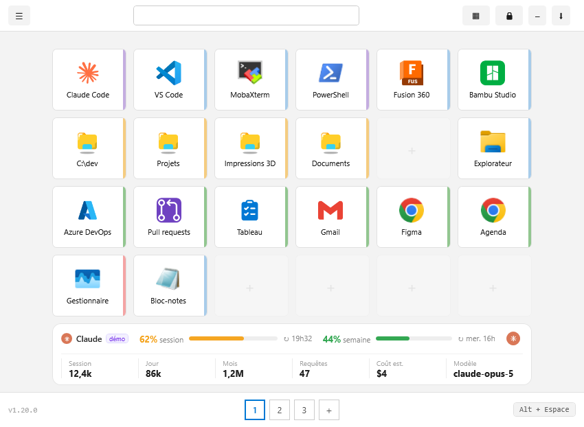
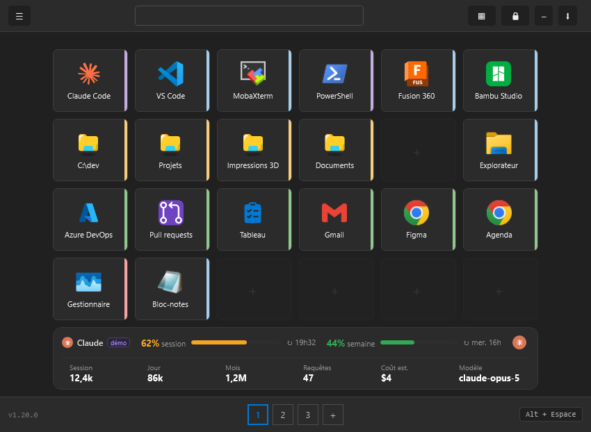
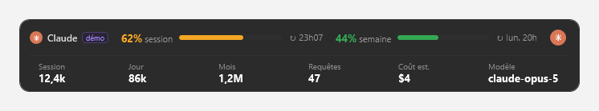
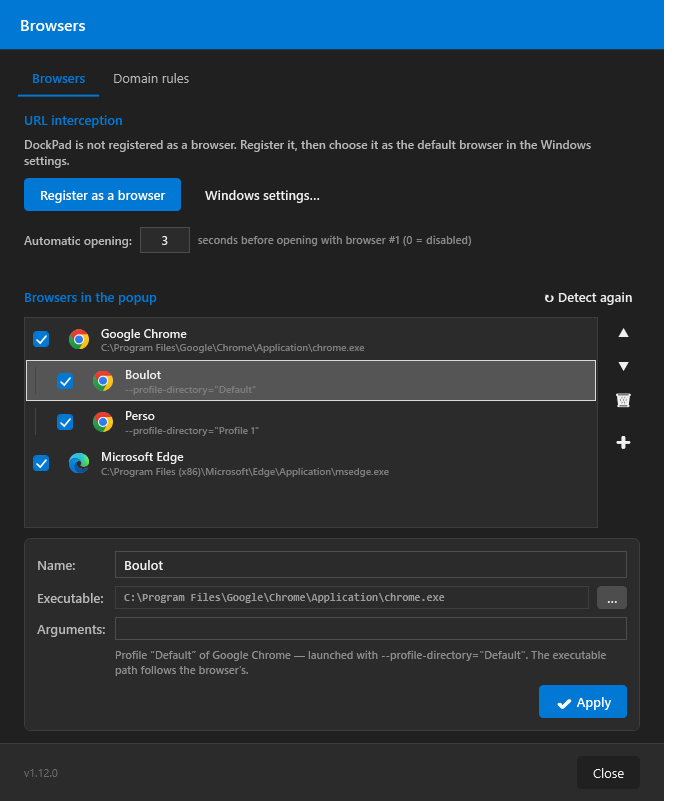
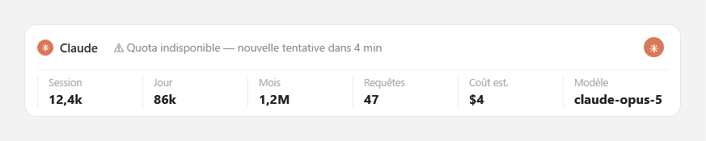
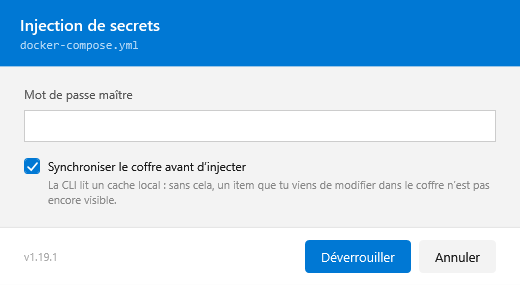
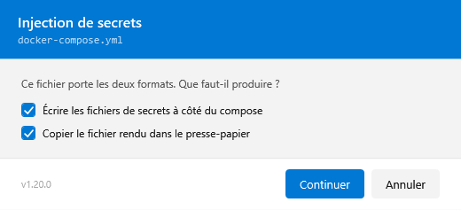
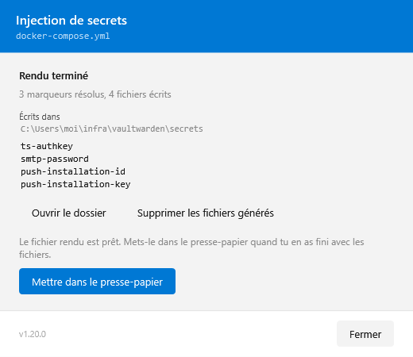
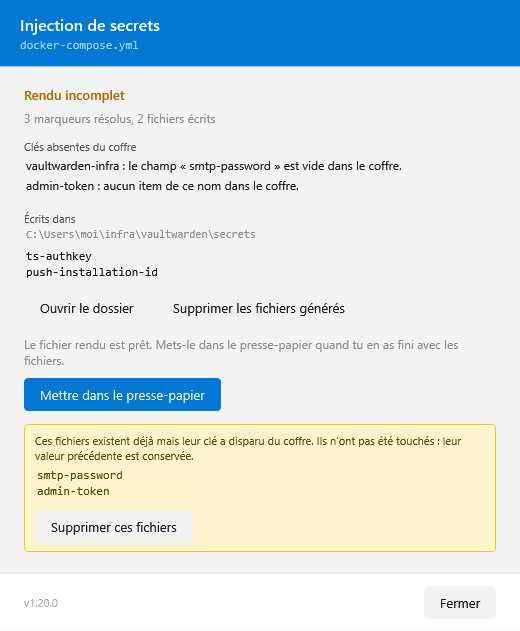

# DockPad

Application WPF (.NET 8, x64) de **barre de lancement rapide** avec gestion du menu contextuel Windows.

## Fonctionnalités

- **Grille de tuiles** multi-pages (4 × 6) avec raccourci clavier global configurable
- **Types de raccourcis** : lancer une commande, ouvrir un dossier, URL, terminal, basculer vers un processus
- **Drag & drop** depuis l'Explorateur Windows (dossier → OpenFolder, fichier .url → OpenUrl)
- **Thème clair et sombre**, lié à Windows ou choisi — bascule immédiate, barre de titre comprise
- **Français, anglais et « 1337 »**, avec bascule immédiate depuis les Options — aucun redémarrage, les fenêtres ouvertes se retraduisent. Par défaut DockPad suit la langue de Windows
- **Verrou du déplacement des tuiles** : un bouton de la toolbar (🔒 → ✓) ouvre la réorganisation, pour qu'un clic manqué ne déplace pas la tuile qu'on voulait lancer. Ranger la fenêtre repose le verrou
- **Barre de recherche** globale avec navigation clavier
- **Overlay numérique** (Ctrl/Shift + 1–9) pour exécution rapide au clavier
- **Store d'icônes** portable dans `%APPDATA%\DockPad\icons\`
- **Gestionnaire de menu contextuel** Windows (HKCU / HKLM / HKCR)
- **Raccourcis prédéfinis** : Claude Code, PowerShell, VS Code, SSMS, GitHub Desktop
- **Sélecteur de navigateur** : popup de choix au clic sur une URL + règles par domaine
- **Serveur MCP** : Claude (Claude Code / Claude Desktop) peut gérer la grille, les pages et les navigateurs
- **Bandeau Usage IA** : consommation de jetons de Claude Code, Codex, Gemini et Copilot, sous la grille
- **Injection de secrets** : clic droit sur un fichier → ses marqueurs `{{ bw:… }}` sont remplacés par les valeurs de Vaultwarden, dans le presse-papier ou dans des fichiers de secrets
- **Icône systray** — l'application tourne en arrière-plan, instance unique (Mutex)
- **Démarrage automatique** avec Windows configurable



## Thème clair et sombre

☰ → Paramètres → **Thème** : `Automatique (Windows)`, `Clair` ou `Sombre`.

| Clair | Sombre |
|---|---|
|  |  |

- **`Automatique` suit Windows en direct** : basculer Windows en sombre change DockPad sur le champ, sans redémarrer. Un choix explicite, lui, ne bouge plus
- **La barre de titre suit aussi** — Windows ne la peint pas de lui-même
- La bascule s'applique aux **fenêtres déjà ouvertes**

Le bandeau Usage IA et les fenêtres de configuration suivent le thème, listes et champs compris :

| Bandeau Usage IA | Fenêtre Navigateurs |
|---|---|
|  |  |

> Les cases à cocher et les listes déroulantes ont changé d'aspect **dans les deux thèmes** : elles
> sont passées de l'habillage Windows au plat, déjà celui du reste de l'application. C'était le prix
> pour qu'elles suivent le thème — leur habillage d'origine ignore les couleurs qu'on leur donne.

## Français, anglais… et 1337

☰ → Paramètres → **Langue** : `Automatique (Windows)`, `Français`, `English` ou `1337`. Par défaut DockPad
suit la langue de Windows, et retombe sur l'anglais si elle n'est pas traduite.

| Français | English |
|---|---|
|  |  |

- **Bascule immédiate**, sans redémarrer : les fenêtres ouvertes se retraduisent sous les yeux, la grille derrière et son bandeau compris
- **Les nombres et les heures suivent** : `12,4k` et `11h54` en français, `12.4k` et `11:54` en anglais
- **Les pluriels sont justes**, y compris là où les deux langues ne basculent pas au même endroit : « 0 règle » mais « 0 rules »
- **Les libellés du menu clic droit de Windows** sont traduits ; les entrées déjà posées se mettent à jour depuis la fenêtre **Prédéfinis**

Et une troisième langue, pour le plaisir :


Elle n'est pas écrite à la main : elle est **engendrée** depuis le français par substitution de
glyphes, et se régénère d'une commande quand une chaîne est ajoutée. Elle rend un service au
passage — **tout ce qui n'y apparaît pas en leet est soit une donnée, soit une chaîne restée en dur
dans le code**. Les noms de tuiles, eux, restent lisibles : ce sont les vôtres.

## Sélecteur de navigateur

DockPad peut devenir le navigateur par défaut de Windows : au clic sur une URL, une popup propose le choix du navigateur **et de ses profils**. Les règles « Toujours pour ce domaine » ouvrent les sites connus directement, sans popup (sous-domaines inclus).

Les profils des navigateurs Chromium (Chrome, Edge, Brave, Vivaldi…) sont détectés par **↻ Redétecter** et proposés sous leur navigateur ; un navigateur qui n'a qu'un seul profil reste une ligne unique. Chaque profil se masque, se renomme et peut recevoir ses propres règles de domaine.

| Popup au clic sur une URL | Navigateurs et profils | Règles de domaine |
|:---:|:---:|:---:|
|  |  |  |

Clavier : `1-9` choix direct · `↑/↓` + `Entrée` · `Échap` annule · perte de focus = annule.

### Activer sur un ordinateur

- [ ] Lancer DockPad
- [ ] **☰ → Paramètres → 🌐 Navigateurs** → **↻ Redétecter** puis vérifier la liste (Chrome, Edge… et leurs profils)
- [ ] Cliquer **S'enregistrer comme navigateur**
- [ ] Cliquer **Paramètres Windows…** → définir **DockPad** comme navigateur par défaut
- [ ] Cliquer une URL n'importe où → la popup s'affiche ; cocher **Toujours pour ce domaine** pour créer une règle
- [ ] Gérer les règles dans l'onglet **Règles de domaine** (recherche, filtre, réassociation, suppression)

## Bandeau Usage IA

Un bandeau sous la grille montre la consommation des assistants IA détectés : les deux jauges de quota (session de 5 h et semaine) avec leur heure de remise à zéro, puis les jetons de la session, du jour et du mois, le nombre de requêtes, le coût estimé et le modèle en cours. Un onglet par fournisseur quand il y en a plusieurs.


Avec plusieurs fournisseurs, un onglet apparaît pour chacun :


Quatre assistants sont lus, chacun dans ses fichiers locaux, sans réseau :

| Assistant | Source | Quota | Coût |
|---|---|---|---|
| **Claude Code** | `%USERPROFILE%\.claude\projects` | oui | estimé |
| **Codex** | `%USERPROFILE%\.codex\sessions` et `archived_sessions` | non | non |
| **Gemini CLI** | `%USERPROFILE%\.gemini\tmp\<hash>\chats` | non | non |
| **Copilot CLI** | `%USERPROFILE%\.copilot\session-store.db` | non | non |

Seul Claude expose des pourcentages de quota : ils viennent de l'API Anthropic, avec le jeton du compte déjà présent sur la machine. Pour les trois autres, il n'existe pas de limite lisible localement — leurs deux jauges restent donc masquées, et seules les métriques de jetons s'affichent.

Si le quota Claude n'est pas joignable — l'API limite le débit, le jeton a expiré, la réponse change de forme — **les jauges cèdent la place à une explication** qui annonce la prochaine tentative, avec la cause technique au survol. Les jetons, eux, sont lus en local : ils restent exacts et affichés.



Un assistant **installé mais que tu n'as pas utilisé sur la période** garde son onglet, à zéro : disparaître du bandeau veut dire « pas installé », et rien d'autre. Les valeurs qui n'auraient pas de sens s'affichent `—` plutôt que `0`.


Le **coût** n'est calculé que pour Claude, à partir des tarifs publics, et affiché dans la devise de la source — DockPad ne convertit jamais. Un abonnement Max ou Pro ne facture pas au jeton : le montant indique un ordre de grandeur, pas une facture. Pour les trois autres, la colonne affiche un tiret plutôt qu'un montant inventé.

Un fournisseur **Démo** est fourni, masqué par défaut : il sert aux captures de documentation et permet d'essayer le changement d'onglet. Les chiffres de démonstration portent toujours un badge « démo ».

Réglages via **☰ Menu → Paramètres → 📊 Usage IA** : afficher ou masquer le bandeau, seuil d'alerte des jauges, affichage du coût, fournisseur affiché à l'ouverture, et détection des assistants installés (**↻ Redétecter**, jamais en tâche de fond).


## Serveur MCP — piloter DockPad avec Claude

DockPad expose un serveur [MCP](https://modelcontextprotocol.io) : depuis Claude Code ou Claude Desktop, Claude peut lire l'état de la grille, ajouter des raccourcis (unitairement ou en lot), créer et réorganiser des pages, et gérer les navigateurs et règles de domaine — la grille se met à jour en direct, sans toucher à l'application.

> « Ajoute une page avec VS Code, un terminal sur C:\dev et le dossier du projet » → trois tuiles apparaissent, placées sur les cases libres.

| Configuration (Options) | Journal des actions |
|:---:|:---:|
|  |  |

**13 outils** `dockpad_<domaine>_<action>` (positions 0-based : page 0, lignes 0-3, colonnes 0-5) :

| Domaine | Outils |
|---|---|
| Grille | `grid_get` · `shortcut_add` (lot tout-ou-rien) · `shortcut_update` · `shortcut_move` · `shortcut_delete` 🔒 |
| Pages | `page_add` · `page_update` (icône, position) · `page_delete` 🔒 |
| Navigateurs | `browser_list` · `browser_update` · `rule_list` · `rule_add` · `rule_delete` 🔒 |

**Sécurité par défaut** : les outils 🔒 de suppression sont refusés tant que la case « Autoriser Claude à supprimer » n'est pas cochée — Claude peut construire, pas détruire. Chaque action (exécutée ✅, refusée 🚫 ou en erreur ❌) est visible dans l'onglet **Journal** et tracée dans les logs. Configuration dans `%APPDATA%\DockPad\mcp.json`, incluse dans 💾 Sauvegarder la configuration.

### Activer sur un ordinateur

- [ ] Lancer DockPad (l'application doit tourner : le serveur MCP dialogue avec l'instance en cours)
- [ ] **☰ → Paramètres → 🔌 Serveur MCP** → onglet Options
- [ ] Copier la commande d'enregistrement (⧉) et l'exécuter dans un terminal :
  `claude mcp add dockpad -s user -- "C:\DockPad\DockPad.exe" --mcp`
  (décocher « Pour tous les projets » pour un enregistrement limité au projet courant ; snippet `claude_desktop_config.json` fourni pour Claude Desktop)
- [ ] Ouvrir une session Claude Code → `/mcp` liste le serveur `dockpad` et ses 13 outils
- [ ] Demander par exemple : *« montre-moi ma grille DockPad »* ou *« ajoute un raccourci Bloc-notes »*
- [ ] En cas de changement de chemin de l'exe : `claude mcp remove dockpad` puis ré-ajouter (bloc « Mise à jour du chemin » de la fenêtre)

## Injection de secrets depuis Vaultwarden

Clic droit sur **n'importe quel fichier** → **Injecter les secrets…**. DockPad remplace les marqueurs `{{ bw:item:champ }}` par les valeurs du coffre, et **le fichier dit lui-même ce qu'on fait de lui** — il n'y a rien à choisir au moment du clic.

| Ce que porte le fichier | Ce que DockPad produit |
|---|---|
| des marqueurs `{{ bw:item:champ }}` | le rendu dans le **presse-papier**, prêt à coller |
| des annotations `x-bw:` sous `secrets:` | les **fichiers de secrets** dans un sous-dossier `secrets/` |
| les deux | **les deux**, avec un écran pour choisir |
| un marqueur précédé d'un antislash — `\{{ … }}` | le marqueur **littéral** : un README peut documenter la syntaxe |

| Mot de passe maître | Choix des sorties | Compte-rendu |
|:---:|:---:|:---:|
|  |  |  |

**Aucune clé de session n'est conservée** : le mot de passe maître est redemandé à chaque injection, il ne quitte jamais l'environnement du processus enfant, et il n'apparaît dans aucune ligne de commande. Le rendu est retiré du presse-papier après un délai réglable (90 s par défaut), **à condition qu'il s'y trouve toujours** — si tu as copié autre chose entre-temps, rien n'est effacé.

### Syntaxe des marqueurs

```
{{ bw:<item>:<champ> }}
```

Les espaces autour des `:` et des accolades sont facultatifs — `{{bw:item:champ}}` marche aussi. Le
**nom d'item accepte les espaces** (`{{ bw:Infra maison:token }}`), le nom de champ non : le `:` et le
`}}` suffisent à délimiter.

Un marqueur se remplace **dans n'importe quel fichier**, pas seulement du YAML — un `.env`, un
`Dockerfile`, un script. C'est le contenu qui décide, jamais l'extension.

**L'item est cherché par son nom exact**, sans tenir compte de la casse :

| Ce que le coffre répond | Ce que DockPad fait |
|---|---|
| un seul item de ce nom | il est utilisé |
| aucun | refus **qui nomme l'item**, et rappelle l'organisation si une est configurée |
| deux ou plus | refus : DockPad ne devine pas. Renommer l'un des deux, ou cantonner à une organisation |

**Le champ suit un ordre, et le personnalisé gagne toujours :**

| `<champ>` | Ce qui est lu |
|---|---|
| n'importe quel nom | le **champ personnalisé** de ce nom, s'il existe |
| `password` | le mot de passe de l'identifiant |
| `username` | l'identifiant |
| `notes` | les notes de l'item |
| `totp` | la graine TOTP |

Un champ personnalisé nommé `password` masque donc le mot de passe standard — et **ne retombe pas
dessus s'il est vide** : le champ qu'on a nommé soi-même existe, et le dire franchement vaut mieux
que d'aller chercher ailleurs une valeur que personne n'a demandée.

Une **valeur vide compte comme absente** : le champ existe mais ne porte rien, ce qui produirait une
ligne syntaxiquement valide et fonctionnellement fausse.

**Deux formes échappent au remplacement :**

| Écrit | Effet |
|---|---|
| `\{{ bw:item:champ }}` | le marqueur **littéral**, antislash retiré, jamais cherché dans le coffre |
| `REMPLACER` | rien — mais il est **signalé** dans le compte-rendu : c'est le marqueur manuel qui a causé la panne d'origine |

### Syntaxe des annotations `x-bw`

Compose ignore tout champ commençant par `x-`, donc l'annotation cohabite sans rien changer au déploiement :

```yaml
secrets:
  ntfy-ts-authkey:
    file: /share/.../secrets/ts-authkey
    x-bw:
      item: ntfy-infra          # la valeur du coffre EST le contenu
      field: ntfy-ts-authkey

  ntfy-config:
    file: /share/.../secrets/server.yml
    x-bw:
      template: templates/ntfy-config/server.yml   # un modèle local est rendu
```

Chaque entrée annotée doit porter un `file:` : **son nom de base** devient le nom du fichier produit
(`ts-authkey`, et non la clé du secret). Le chemin complet vise le NAS et n'est pas exploitable ici.

`item` + `field` et `template` sont **exclusifs** — les deux ensemble sont un refus, il n'y a qu'un
fichier à produire ; aucun des deux également.

`template:` sert aux fichiers de **structure** dont seules quelques valeurs sont sensibles. Le modèle
reste versionné à sa place, `secrets/` ne contient que du produit — et s'ignore lui-même par un
`.gitignore` posé automatiquement. Trois règles s'y appliquent :

- le chemin est **relatif au dossier du compose** et doit y rester. C'est la seule annotation qui
  désigne *quoi lire*, et elle vient d'un fichier : un chemin qui remonte est refusé ;
- le rendu est **tout ou rien, par fichier** — un seul marqueur non résolu et ce fichier n'est pas
  écrit. Contrairement au presse-papier, où le marqueur reste visible dans ce qu'on colle, un fichier
  part sur le NAS sans être relu ;
- les fins de ligne sont **normalisées en LF** : le modèle vient d'un dépôt git qui a pu l'extraire
  en CRLF, la destination est un conteneur Linux. Une *valeur* du coffre, elle, n'est jamais
  touchée — c'est un secret, on l'écrit telle qu'elle est.

Les fichiers produits n'ont **pas de saut de ligne final** : Vaultwarden rogne ce qu'il lit via
`_FILE`, mais `containerboot` lit `TS_AUTHKEY` par `file:` sans rien rogner.

### Quand une clé manque

Une clé absente du coffre n'annule plus le reste : les secrets présents sont écrits, le rendu est produit, et un écran **ambre** liste ce qui manque. Les marqueurs non résolus restent visibles dans le texte, et un fichier de secret n'est **jamais** écrit vide ou à moitié rendu — il est simplement absent, et nommé.



Les fichiers dont la clé a disparu du coffre sont **signalés, jamais supprimés d'office** : un coffre temporairement inaccessible ne doit pas détruire un déploiement qui marche.

### Activer sur un ordinateur

- [ ] Installer la **CLI Bitwarden** — `winget install Bitwarden.CLI` (le client de bureau ne la fournit pas : ce sont deux produits distincts)
- [ ] `bw config server https://<ton-vaultwarden>` puis `bw login`
- [ ] **☰ → Paramètres → onglet Secrets** : renseigner l'organisation si le coffre en a une, et cocher **Ajouter au menu contextuel**
- [ ] Sur Windows 11, l'entrée est sous **Afficher plus d'options** (Maj + clic droit)
- [ ] Clic droit sur un fichier portant des marqueurs → **Injecter les secrets…**
- [ ] Laisser cochée **Synchroniser le coffre avant d'injecter** : la CLI lit un cache local, et sans elle un item que tu viens de modifier n'est pas encore visible

## Prérequis

- Windows 10/11 x64
- [.NET 8 Runtime](https://dotnet.microsoft.com/download/dotnet/8.0) (Desktop)
- *Pour l'injection de secrets uniquement* : la [CLI Bitwarden](https://bitwarden.com/help/cli/), sous GPL-3.0, à installer séparément — `winget install Bitwarden.CLI`

## Installation

1. Télécharger `DockPad-{version}.zip` depuis `release\`
2. Extraire dans `C:\DockPad\`
3. Lancer `DockPad.exe`

## Build

```bash
dotnet build
```

### Publish (release)

```bash
dotnet publish -p:PublishProfile=FolderProfile
```

Génère `release\DockPad-{version}.zip` et `release\DockPad-{version}-Changelog.md`.

## Configuration

Les fichiers de configuration sont dans `%APPDATA%\DockPad\` :

| Fichier | Contenu |
|---------|---------|
| `shortcuts.json` | Tuiles de la grille de raccourcis |
| `pages.json` | Configuration des boutons de pagination |
| `browsers.json` | Navigateurs du sélecteur + règles de domaine |
| `usage.json` | Bandeau Usage IA : réglages + fournisseurs détectés |
| `icons\` | Cache d'icônes (PNG, déduplication SHA1) |
| `.backup\` | Sauvegardes horodatées |

Les paramètres (hotkey, démarrage auto) sont stockés dans `HKCU\Software\DockPad\Settings`.

## Raccourci clavier par défaut

`Ctrl + Shift + M` — affiche/remet au premier plan la fenêtre principale.
Configurable via **☰ Menu → Options**.
