# DockPad

[Français](README.fr.md) · **English**

A WPF application (.NET 8, x64): a **quick launch bar** for Windows, with a manager for the Windows context menu.

[Download the latest version](https://github.com/syl-craft/DockPad/releases/latest) · [Release history](CHANGELOG.md)

<picture>
  <source media="(prefers-color-scheme: dark)" srcset="https://raw.githubusercontent.com/syl-craft/DockPad-media/main/videos/01-launcher-dark.gif">
  
</picture>

## Features

- **Tile grid** over several pages (4 × 6), with a configurable global hotkey
- **Composite tiles**: a slot can hold one shortcut, four icons in a 2 × 2 grid, or two large cells above four small ones
- **Shortcut types**: run a command, open a folder, open a URL, open a terminal, switch to a process
- **Drag & drop** from Windows Explorer (folder → OpenFolder, `.url` file → OpenUrl)
- **Light and dark theme**, following Windows or chosen — switches instantly, title bar included
- **French, English and “1337”**, switched instantly from the Options — no restart, open windows translate themselves. By default DockPad follows the Windows language
- **Tile moving lock**: a toolbar button (🔒 → ✓) unlocks rearranging, so that a slightly missed click does not move the tile you meant to launch. Putting the window away locks it again
- **Favourites mode**: a second grid, with its own pages and positions, filled from the star of the browser picker (▦ → ★ in the toolbar)
- **Global search bar** with keyboard navigation
- **Keyboard overlay** (modifier + 1–9) to launch tiles from the keyboard
- **Portable icon store** in `%APPDATA%\DockPad\icons\`
- **Windows context menu manager** (HKCU / HKLM / HKCR)
- **Predefined shortcuts**: Claude Code, Codex, PowerShell, VS Code, SSMS, GitHub Desktop
- **Browser picker**: choose the browser when clicking a URL + per-domain rules
- **MCP server**: Claude (Claude Code / Claude Desktop) can manage the grid, the pages and the browsers
- **AI usage panel**: token consumption of Claude Code, Codex, Gemini and Copilot, under the grid
- **Secret injection**: right-click a file → its `{{ bw:… }}` markers are replaced with values from Vaultwarden, into the clipboard or into secret files
- **System tray icon** — the application runs in the background, single instance (Mutex)
- **Start with Windows**, configurable
- **Built-in updates**: optional automatic check, download and restart from the application, handling of blocking processes with consent


## Updates

**☰ Menu → Updates → Check for updates** shows the available version and its notes.
**Update and restart** downloads, installs and restarts DockPad, keeping the profile.
The check can be automatic; installing always happens on request.

| Check and install | Blocking applications |
|---|---|
| 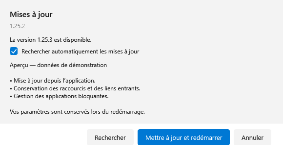 | 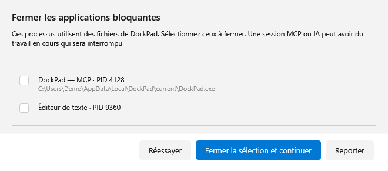 |

The boxes are not ticked by default. DockPad asks for a graceful close, then for a separate
confirmation if a forced stop is needed. **Postpone** keeps the current session.
Versions installed from the old ZIP offer the GitHub link until their first Velopack migration.

## Launching from the keyboard

Hold a modifier: each tile of the left or right half of the grid shows a key (**1–9**, then **0**,
**↑**, **↓** for the bottom row). Press the key and the tile launches. **← / →** switch pages. By
default the two modifiers adapt to the global hotkey: **Ctrl** and **Shift** if it does not use
Ctrl — like `Alt + Space` in the demo —, otherwise **Shift** and **Alt**. They can be set in
**☰ Menu → Options**.

<picture>
  <source media="(prefers-color-scheme: dark)" srcset="https://raw.githubusercontent.com/syl-craft/DockPad-media/main/videos/05-keyboard-dark.gif">
  
</picture>

## Composite tiles

<picture>
  <source media="(prefers-color-scheme: dark)" srcset="https://raw.githubusercontent.com/syl-craft/DockPad-media/main/videos/06-composite-dark.gif">
  
</picture>

| Light | Dark |
|---|---|
|  |  |

From left to right: a single tile, a **2 × 2** grid, a **2 + 4** grid with a custom group colour,
then the same layouts with partly empty cells.

Right-click a tile or an empty slot → **Layout**: single, **2 × 2** grid, or **2 + 4** grid (two
thirds of the height at the top, one third at the bottom). Each icon launches its own shortcut; its
name and command stay available on hover. An empty cell lets you add a shortcut. Groups also work
in the favourites.

The group name is shown at the bottom of the card. **Group → Edit group…** changes its name and the
colour of its right-hand band, purple by default. That band belongs to the group: the icons inside
no longer have a band of their own. Once the padlock is unlocked, dragging the name moves the whole
group; dragging an icon moves only its shortcut.

- **Move → Choose a slot…**: the possible destinations are outlined. Clicking an empty slot moves
  the shortcut; clicking a shortcut swaps it with the source. Paging stays available and **Esc**
  cancels the move.
- **Drag and drop**, once the padlock is unlocked, also works between the grid and the cells, and
  between two groups.
- **Group → Move the entire group…** moves all its shortcuts together. The same submenu duplicates
  the group, moves it to another page or transfers it to the favourites.
- To go from six cells to four, first move the extra shortcuts out. To go back to a single tile, at
  most one may remain. No shortcut is ever moved out of the group automatically. The shortcuts that
  are kept follow reading order.
- Search includes the shortcuts inside groups. The keyboard shortcut of a composite tile opens a
  menu to choose which one to launch. Groups cannot be nested.

Older shortcut files remain readable. Groups add the fields `layout` (`Quad` or `TwoPlusFour`),
`children` and an optional `groupColor`; a `null` value in `children` keeps an empty cell.
The MCP grid-reading tool exposes this information too; MCP actions that only target a whole slot
move or delete the whole group.

## Light and dark theme

☰ → Settings → **Theme**: `Automatic (Windows)`, `Light` or `Dark`.

| Light | Dark |
|---|---|
|  | 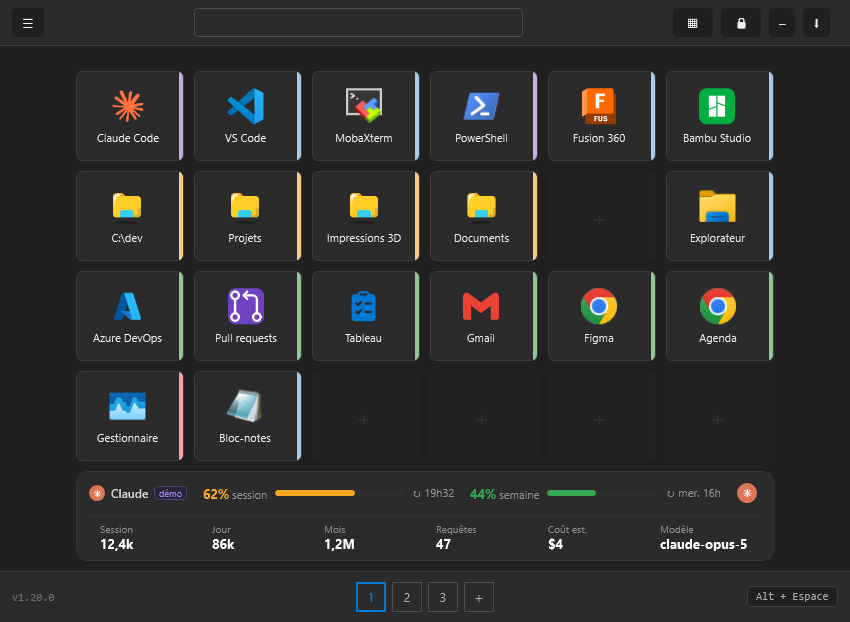 |

- **`Automatic` follows Windows live**: switching Windows to dark changes DockPad on the spot, without a restart. An explicit choice stays put
- **The title bar follows too** — Windows does not paint it on its own
- The switch applies to **windows that are already open**

The AI usage panel and the configuration windows follow the theme, lists and fields included:

| AI usage panel | Browsers window |
|---|---|
| 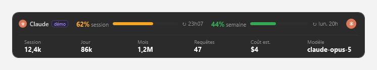 | 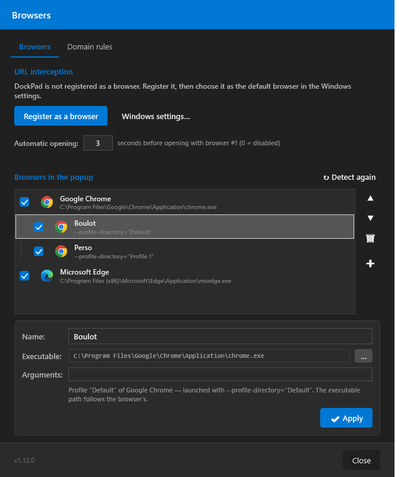 |

> Check boxes and drop-down lists changed appearance **in both themes**: they went from the Windows
> look to flat, the look of the rest of the application. That was the price for following the
> theme — their original template ignores the colours it is given.

## French, English… and 1337

☰ → Settings → **Language**: `Automatic (Windows)`, `Français`, `English` or `1337`. By default
DockPad follows the Windows language, and falls back to English if it is not translated.

| Français | English |
|---|---|
| 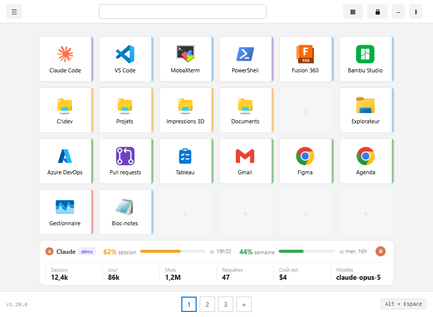 |  |

- **Instant switch**, no restart: open windows translate themselves before your eyes, the grid behind them and its panel included
- **Numbers and times follow**: `12,4k` and `11h54` in French, `12.4k` and `11:54` in English
- **Plurals are right**, including where the two languages do not switch at the same point: “0 règle” but “0 rules”
- **The labels of the Windows right-click menu** are translated; entries already installed are updated from the **Predefined shortcuts** window

And a third language, for fun:


It is not written by hand: it is **generated** from French by glyph substitution, and regenerated
with one command whenever a string is added. It does a job along the way — **anything that does not
show up in leet is either data or a string left hard-coded**. Tile names stay readable: they are
yours.

## Browser picker

DockPad can become the default browser of Windows: when you click a URL, a popup offers a choice of
browser **and of its profiles**. “Always for this domain” rules open known sites directly, without
the popup (subdomains included).

<picture>
  <source media="(prefers-color-scheme: dark)" srcset="https://raw.githubusercontent.com/syl-craft/DockPad-media/main/videos/02-browser-picker-dark.gif">
  
</picture>

Profiles of Chromium browsers (Chrome, Edge, Brave, Vivaldi…) are detected by **↻ Detect again**
and listed under their browser; a browser with a single profile stays a single line. Each profile
can be hidden, renamed and given its own domain rules.

| Popup when clicking a URL | Browsers and profiles | Domain rules |
|:---:|:---:|:---:|
| 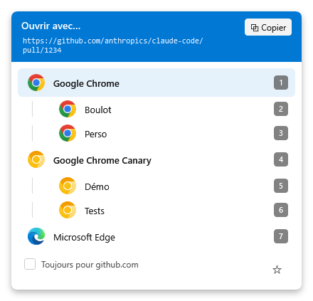 |  |  |

Keyboard: `1-9` picks directly · `↑/↓` + `Enter` · `Esc` cancels · losing focus cancels.

### Enabling it on a computer

- [ ] Start DockPad
- [ ] **☰ → Settings → 🌐 Browsers** → **↻ Detect again**, then check the list (Chrome, Edge… and their profiles)
- [ ] Click **Register as a browser**
- [ ] Click **Windows settings…** → set **DockPad** as the default browser
- [ ] Click a URL anywhere → the popup appears; tick **Always for this domain** to create a rule
- [ ] Manage the rules in the **Domain rules** tab (search, filter, reassign, delete)

## Favourites mode

A **second grid**, dedicated to websites: its own pages, its own positions, and everything the
shortcut grid already does — drag and drop, right-click, keyboard overlay, search. The **▦ / ★**
toolbar button, to the left of the lock, switches between the two.

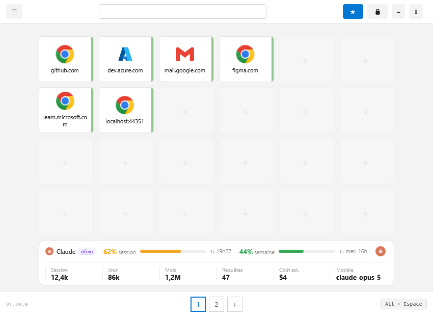

Pages are added from the browser picker: the **star at the bottom right** adds the current page to
the favourites, and removes it when unticked. It is already lit when the popup opens if the URL is
there — a toggle that shows a state tells the truth, and you can add a favourite without opening the
link.

- The favourite keeps the **full URL** and takes the **domain** as its tile name; the site icon is
  downloaded like for any web tile (setting Options → *Network*)
- It lands in the **first free slot**, pages scanned in order; if everything is full, a page is
  created
- **A tile moves from one grid to the other** from the right-click menu: “★ Move to favourites”, or
  “▦ Move to shortcuts” from the favourites. It keeps its icon and configuration, and lands in the
  first free slot
- **The mode does not survive putting the window away**: hiding or minimising brings back the
  shortcuts. It is a detour, not a setting — nothing is written to disk
- Favourites live in `%APPDATA%\DockPad\favorites.json` and `favorite-pages.json`, **same format**
  as the shortcuts, and are included in 💾 *Save*

## AI usage panel

A panel under the grid shows the consumption of the detected AI assistants: the two quota gauges
(5-hour session and week) with their reset time, then the tokens of the session, the day and the
month, the number of requests, the estimated cost and the current model. One tab per provider when
there are several.

<picture>
  <source media="(prefers-color-scheme: dark)" srcset="https://raw.githubusercontent.com/syl-craft/DockPad-media/main/videos/03-usage-dark.gif">
  
</picture>

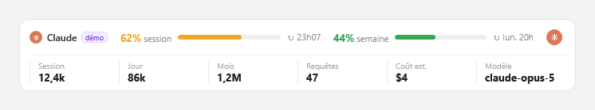

With several providers, each gets a tab:

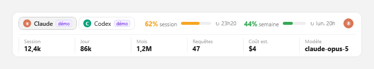

Four assistants are read, each from its own local files, without any network access:

| Assistant | Source | Quota | Cost |
|---|---|---|---|
| **Claude Code** | `%USERPROFILE%\.claude\projects` | yes | estimated |
| **Codex** | `%USERPROFILE%\.codex\sessions` and `archived_sessions` | yes, latest local reading | no |
| **Gemini CLI** | `%USERPROFILE%\.gemini\tmp\<hash>\chats` | no | no |
| **Copilot CLI** | `%USERPROFILE%\.copilot\session-store.db` | no | no |

Claude quotas come from the Anthropic API, with the account token already present on the machine.
**Codex** quotas are read from the `token_count` events of the local sessions: no extra process and
no access to credentials is needed. The most recent reading is kept across sessions and archives,
by its observation date.

Each Codex gauge follows the announced window: 5 h for the session, 7 days for the week. An account
that only exposes a weekly limit shows only that gauge, even if Codex puts it in the `primary`
field. An expired window or a reading older than **15 minutes** is hidden; if no gauge is available,
a notice explains why. Using Codex refreshes the readings, which DockPad reads again at the next
refresh. Gemini and Copilot have no gauges.

A single gauge takes the whole available width; two gauges share it.
The badge on the right opens the usage web page of Claude or Codex.

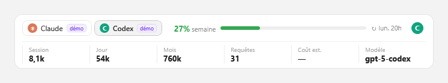

If the Claude quota cannot be reached — the API is rate limiting, the token has expired, the response
changed shape — **the gauges give way to an explanation** that announces the next attempt, with the
technical cause on hover. Tokens are read locally: they stay exact and displayed.


An assistant **installed but not used during the period** keeps its tab, at zero: disappearing from
the panel means “not installed”, and nothing else. Values that would make no sense are shown as `—`
rather than `0`.


The **cost** is only computed for Claude, from the public prices, and shown in the currency of the
source — DockPad never converts. A Max or Pro subscription is not billed per token: the amount is an
order of magnitude, not an invoice. For the three others, the column shows a dash rather than an
invented amount.

A **Demo** provider is included, hidden by default: it is used for documentation captures and lets
you try tab switching. Demo figures always carry a “demo” badge.

Settings in **☰ Menu → Settings → 📊 AI usage**: show or hide the panel, gauge alert threshold, cost
display, provider shown on opening, and detection of the installed assistants (**↻ Detect again**,
never in the background).


## MCP server — driving DockPad with Claude

DockPad exposes an [MCP](https://modelcontextprotocol.io) server: from Claude Code or Claude
Desktop, Claude can read the state of the grid, add shortcuts (one by one or in a batch), create and
reorder pages, and manage browsers and domain rules — the grid updates live, without touching the
application.

> “Add a page with VS Code, a terminal on C:\dev and the project folder” → three tiles appear, placed in the free slots.

| Configuration (Options) | Action log |
|:---:|:---:|
|  |  |

**14 tools** `dockpad_<domain>_<action>` (0-based positions: page 0, rows 0-3, columns 0-5):

| Domain | Tools |
|---|---|
| Grid | `grid_get` · `shortcut_add` (all-or-nothing batch) · `shortcut_update` · `shortcut_move` · `shortcut_delete` 🔒 · `group_set` |
| Pages | `page_add` · `page_update` (icon, position) · `page_delete` 🔒 |
| Browsers | `browser_list` · `browser_update` · `rule_list` · `rule_add` · `rule_delete` 🔒 |

`dockpad_shortcut_move` also accepts a **`toTarget`**: omitted, the move stays within the grid as
before; different from `target`, the tile changes grid and lands in the first free slot, keeping its
icon.

**Grouped tiles**: `dockpad_group_set` creates a group (`Quad` or `TwoPlusFour`) on an empty slot or
around an existing tile, and changes its layout, name or colour. Cells are filled with
`shortcut_add` and a **`slot`**; `shortcut_update`, `shortcut_delete` and `shortcut_move` accept
`slot` as well, and `shortcut_move` a `toSlot` to put a tile into a **free** cell — the server
refuses an occupied cell instead of swapping, as everywhere else. `grid_get` exposes `groupColor`
and `freeSlots`.

The nine grid and page tools accept an optional **`target`** — `"shortcuts"` (default) or
`"favorites"` — to work on either grid. An unknown value is refused rather than brought back to the
shortcuts: writing to the wrong grid without saying so would be worse.

**Safe by default**: the 🔒 delete tools are refused until the “Allow Claude to delete” box is ticked
— Claude can build, not destroy. Each action (executed ✅, refused 🚫 or failed ❌) is visible in the
**Journal** tab and traced in the logs. Configuration lives in `%APPDATA%\DockPad\mcp.json`,
included in 💾 Save.

### Enabling it on a computer

- [ ] Start DockPad (the application must be running: the MCP server talks to the running instance)
- [ ] **☰ → Settings → 🔌 MCP server** → Options tab
- [ ] Copy the registration command (⧉) and run it in a terminal:
  `claude mcp add dockpad -s user -- "C:\DockPad\DockPad.exe" --mcp`
  (untick “For every project” to register it for the current project only; a
  `claude_desktop_config.json` snippet is provided for Claude Desktop)
- [ ] Open a Claude Code session → `/mcp` lists the `dockpad` server and its 14 tools
- [ ] Ask for instance: *“show me my DockPad grid”* or *“add a Notepad shortcut”*
- [ ] If the exe path changes: `claude mcp remove dockpad`, then add it again (“Updating the path” block of the window)

## Secret injection from Vaultwarden

Right-click **any file** → **Inject secrets…**. DockPad replaces the `{{ bw:item:field }}` markers
with the values from the vault, and **the file itself says what to do with it** — there is nothing
to choose at click time.

| What the file carries | What DockPad produces |
|---|---|
| `{{ bw:item:field }}` markers | the rendered file in the **clipboard**, ready to paste |
| `x-bw:` annotations under `secrets:` | the **secret files** in a `secrets/` subfolder |
| both | **both**, with a screen to choose |
| a marker preceded by a backslash — `\{{ … }}` | the **literal** marker: a README can document the syntax |

<picture>
  <source media="(prefers-color-scheme: dark)" srcset="https://raw.githubusercontent.com/syl-craft/DockPad-media/main/videos/04-secrets-dark.gif">
  
</picture>

| Master password | Choice of outputs | Report |
|:---:|:---:|:---:|
| 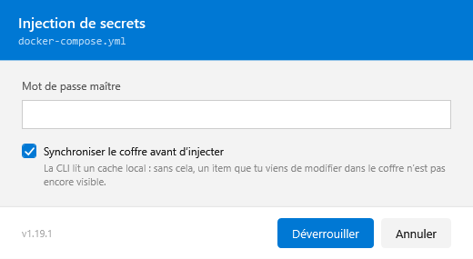 |  | 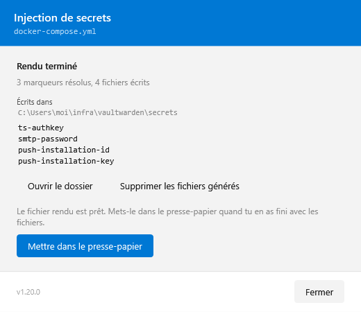 |

**No session key is kept**: the master password is asked for at every injection, it never leaves the
environment of the child process, and it appears on no command line. The rendered file is removed
from the clipboard after an adjustable delay (90 s by default), **provided it is still there** — if
you copied something else in the meantime, nothing is cleared.

### Marker syntax

```
{{ bw:<item>:<field> }}
```

Spaces around the `:` and the braces are optional — `{{bw:item:field}}` works too. The **item name
accepts spaces** (`{{ bw:Home infra:token }}`), the field name does not: the `:` and the `}}` are
enough to delimit it.

A marker is replaced **in any file**, not just YAML — a `.env`, a `Dockerfile`, a script. The content
decides, never the extension.

**The item is looked up by its exact name**, case-insensitively:

| What the vault answers | What DockPad does |
|---|---|
| a single item with that name | it is used |
| none | refusal **naming the item**, with a reminder of the organisation if one is configured |
| two or more | refusal: DockPad does not guess. Rename one of them, or restrict to an organisation |

**The field follows an order, and a custom field always wins:**

| `<field>` | What is read |
|---|---|
| any name | the **custom field** with that name, if it exists |
| `password` | the login password |
| `username` | the login username |
| `notes` | the item notes |
| `totp` | the TOTP seed |

A custom field named `password` therefore hides the standard password — and **does not fall back to
it when empty**: the field you named yourself exists, and saying so plainly beats fetching elsewhere
a value nobody asked for.

An **empty value counts as missing**: the field exists but holds nothing, which would produce a line
that is syntactically valid and functionally wrong.

**Two forms escape replacement:**

| Written | Effect |
|---|---|
| `\{{ bw:item:field }}` | the **literal** marker, backslash removed, never looked up in the vault |
| `REMPLACER` | nothing — but it is **reported** in the summary: it is the manual marker that caused the original failure |

### `x-bw` annotation syntax

Compose ignores any field starting with `x-`, so the annotation sits alongside without changing
anything to the deployment:

```yaml
secrets:
  ntfy-ts-authkey:
    file: /share/.../secrets/ts-authkey
    x-bw:
      item: ntfy-infra          # the vault value IS the content
      field: ntfy-ts-authkey

  ntfy-config:
    file: /share/.../secrets/server.yml
    x-bw:
      template: templates/ntfy-config/server.yml   # a local template is rendered
```

Every annotated entry must carry a `file:`: **its base name** becomes the name of the produced file
(`ts-authkey`, not the secret key). The full path targets the NAS and cannot be used here.

The names `.gitignore` and those ending in `.dockpad-tmp` are reserved, case-insensitively. Names
ending with a dot or a space are refused too. A reserved name or two destinations with the same name
get the batch refused before anything is written.

`item` + `field` and `template` are **exclusive** — both together are a refusal, there is only one
file to produce; neither of them is a refusal too.

`template:` is for **structure** files where only a few values are sensitive. The template stays
versioned where it is, `secrets/` only holds output — and ignores itself through a `.gitignore`
written automatically. Three rules apply:

- the path is **relative to the compose folder** and must stay inside it. It is the only annotation
  that says *what to read*, and it comes from a file: a path that goes up is refused;
- the rendering is **all or nothing, per file** — a single unresolved marker and that file is not
  written. Unlike the clipboard, where the marker stays visible in what you paste, a file goes to the
  NAS without being reread;
- line endings are **normalised to LF**: the template comes from a git repository that may have
  checked it out with CRLF, the destination is a Linux container. A *value* from the vault is never
  touched — it is a secret, it is written as it is.

The produced files have **no trailing newline**: Vaultwarden trims what it reads through `_FILE`,
but `containerboot` reads `TS_AUTHKEY` through `file:` without trimming anything.

### When a key is missing

A key missing from the vault no longer cancels the rest: the secrets that exist are written, the
rendered file is produced, and an **amber** screen lists what is missing. Unresolved markers stay
visible in the text, and a secret file is **never** written empty or half rendered — it is simply
absent, and named.


Files whose key has disappeared from the vault are **reported, never deleted automatically**: a
vault that is temporarily unreachable must not destroy a deployment that works.

### Enabling it on a computer

- [ ] Install the **Bitwarden CLI** — `winget install Bitwarden.CLI` (the desktop client does not provide it: they are two separate products)
- [ ] `bw config server https://<your-vaultwarden>` then `bw login`
- [ ] **☰ → Settings → Secrets tab**: fill in the organisation if the vault has one, and tick the **“Inject secrets…” entry in the Windows context menu**
- [ ] On Windows 11, the entry is under **Show more options** (Shift + right-click)
- [ ] Right-click a file carrying markers → **Inject secrets…**
- [ ] Keep **Refresh the vault before injecting** ticked: the CLI reads a local cache, and without it an item you have just changed is not visible yet

## Requirements

- Windows 10/11 x64
- [.NET 8 Runtime](https://dotnet.microsoft.com/download/dotnet/8.0) (Desktop)
- *For secret injection only*: the [Bitwarden CLI](https://bitwarden.com/help/cli/), under GPL-3.0, installed separately — `winget install Bitwarden.CLI`

## Installation

1. Download `DockPad-X.Y.Z-win-x64-Setup.exe` from the assets of the [latest GitHub release](https://github.com/syl-craft/DockPad/releases/latest), then run it for a per-user installation.
2. For portable mode, extract `DockPad-win-Portable.zip` into an empty folder and start `DockPad.exe` at its root.
3. Coming from an old ZIP, close DockPad before this first migration. Settings stay in `%APPDATA%\DockPad`. MCP clients pointing at an old folder must use the new stable launcher.

Windows x64 with the .NET Desktop Runtime 8. The Setup can install the missing runtime.
The first Velopack release is **unsigned**: Windows may show a warning about the publisher.
SignPath and WinGet publishing are in preparation. The `.nupkg` packages and `releases.win.json` are
meant for the update system; to install, use the Setup or the portable build.

## Build

```bash
dotnet build
```

### Publish (release)

```bash
dotnet publish -p:PublishProfile=FolderProfile
```

Produces `release\DockPad-{version}.zip` and `release\DockPad-{version}-Changelog.md`.

## Configuration

Configuration files live in `%APPDATA%\DockPad\`:

| File | Content |
|---------|---------|
| `shortcuts.json` | Tiles of the shortcut grid |
| `pages.json` | Configuration of the page buttons |
| `favorites.json`, `favorite-pages.json` | Tiles and pages of the favourites grid |
| `settings.json` | Application settings: keyboard shortcut, language, theme, etc. |
| `mcp.json` | MCP server activation and delete permission |
| `browsers.json` | Browsers of the picker + domain rules |
| `usage.json` | AI usage panel: settings + detected providers |
| `icons\` | Icon cache (PNG, SHA1 deduplication) |
| `.backup\` | Timestamped backups |

JSON saves replace the file only after a temporary file has been fully written in the same folder.
If a configuration cannot be read, DockPad uses fallback values for display and refuses to save them
over the existing file. After repairing or restoring the file, refreshing the view concerned or
restarting DockPad reads it again and lets you resume editing. The log names the file at fault.

Older settings from `HKCU\Software\DockPad\Settings` are carried over into `settings.json` when it
is created. Start with Windows remains an entry in the Windows registry.

## Default keyboard shortcut

`Ctrl + Shift + M` — shows the main window or brings it to the front.
Configurable in **☰ Menu → Options**.

## Licence

DockPad is distributed under the [MIT licence](LICENSE), copyright 2026 syl-craft.
Dependencies and third-party items keep their respective licences and trademarks, notably
[the provider logos](Assets/ProviderLogos.LICENSE.txt) and Velopack (notice included in the
packages).

## Code signing policy

Trusted signing is **in preparation**, with no SignPath admission obtained so far.
See the [signing policy and activation procedure](docs/code-signing.md).
